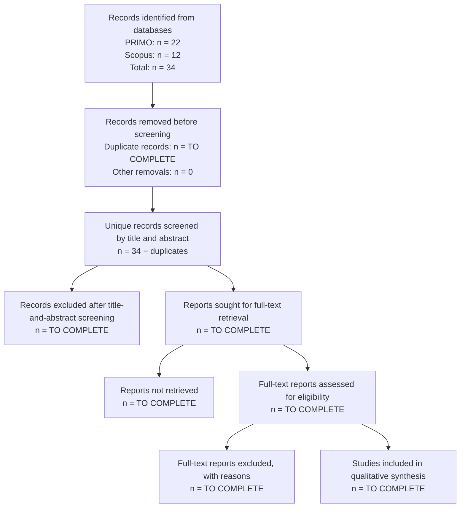

# Literature Gap Analysis

**Session 4**

## 1. Overview

The literature review examined previous research related to banking regulation, compliance-risk management, artificial intelligence, Regulatory Technology (RegTech), Legal Natural Language Processing, semantic embeddings, long-document processing, and Machine Learning-based document classification.

The purpose of the review was to determine whether previous studies had developed an artifact directly comparable to the proposed research: a Machine Learning framework capable of classifying Peruvian regulatory and institutional PDF documents as relevant or not relevant for preliminary regulatory monitoring.

The reviewed literature demonstrates that Artificial Intelligence and Natural Language Processing can support:

- Legal-document classification.
- Regulatory-text analysis.
- Compliance monitoring.
- Semantic document retrieval.
- Classification of long legal documents.
- Multilingual legal-topic classification.
- Automated document review.
- Analysis of regulatory and financial information.

Nevertheless, most identified studies focus on international banking contexts, European regulation, court judgments, contracts, credit-risk applications, financial forecasting, responsible AI, or general compliance frameworks.

Within the literature reviewed, no directly comparable study was identified that combines:

- Peruvian regulatory and institutional PDF documents.
- Binary relevance classification.
- Spanish-language institutional content.
- Multilingual semantic embeddings.
- Fragmentation of long PDF documents.
- Comparison of classical Machine Learning algorithms.
- Preliminary filtering before detailed regulatory review.
- Explicit controls for extraction failures and duplicate documents.

Therefore, this research addresses a contextual, methodological, and empirical gap through the design and evaluation of a reproducible regulatory-document classification artifact.

---

## 2. Literature Review Question

The literature review was guided by the following question:

> What methods have been used to analyze and classify banking, legal, regulatory, compliance, risk-management, and artificial-intelligence documents, and what limitations remain for their application to Peruvian regulatory PDF documents?

The following supporting questions were considered:

1. What methods are used to represent and classify legal or regulatory documents?
2. How are documents that exceed conventional transformer input limits processed?
3. What evidence exists for Spanish-language or multilingual legal classification?
4. Can classical Machine Learning models remain useful when combined with pretrained semantic embeddings?
5. What data-quality controls are applied before training document-classification models?
6. Is preliminary document-relevance filtering addressed before detailed compliance analysis?

---

## 3. Information Sources

The literature discovery process used:

- **PRIMO**, the institutional academic-discovery service.
- **Scopus**, a multidisciplinary abstract and citation database.

Supporting methodological studies were also consulted from recognized academic repositories and publisher records when they were directly relevant to:

- Semantic embeddings.
- Legal-domain language models.
- Multilingual legal classification.
- Long-document classification.
- Regulatory text analysis.
- PRISMA reporting.

---

## 4. Search Strategy

A focused search strategy was applied to identify studies at the intersection of:

1. Banking regulation.
2. Compliance risk.
3. Artificial intelligence.
4. Machine Learning.

The principal conceptual expression was:

```text
("banking regulation framework"
AND "compliance risk"
AND "artificial intelligence")
AND "machine learning"
```

The same conceptual blocks were applied in PRIMO and Scopus, adapting the syntax to the search interface of each database.

The query was intentionally specific because earlier broad searches returned a large number of unrelated studies concerning banking products, credit scoring, fraud detection, employee management, telecommunications, and general Artificial Intelligence applications.

---

## 4.1 PRIMO Search

### Search configuration

The PRIMO advanced-search interface was configured as follows:

| Element | Configuration |
|---|---|
| Search scope | Search all |
| First field | Any field |
| First expression | `Banking regulation framework AND Compliance risk AND Artificial Intelligence` |
| Boolean operator | AND |
| Second field | Any field |
| Second expression | `machine learning` |
| Start date | 1 January 2021 |
| End date | 31 December 2026 |
| Material type | All items during initial retrieval |
| Language | Not restricted during initial retrieval |

### PRIMO result

The focused PRIMO search returned:

```text
22 results
```

These 22 records constituted the PRIMO candidate set for subsequent title-and-abstract screening.

### Interpretation

The PRIMO results included studies related to:

- Machine Learning and Artificial Intelligence in banking.
- Automated credit assessment.
- Responsible AI.
- Financial-risk management.
- Banking cybersecurity.
- Data sovereignty.
- Digital transformation.
- Regulatory compliance.
- Governance and financial decision-making.

However, not every result was directly related to regulatory-document classification. Therefore, retrieval did not automatically imply inclusion in the final evidence synthesis.

---

## 4.2 Scopus Search

### Search configuration

The Scopus search used the following conceptual expression across article titles, abstracts, and keywords:

```text
Banking regulation framework
AND risk compliance
AND artificial intelligence
AND machine learning
```

### Applied filters

The documented search applied the following restrictions:

| Filter | Value |
|---|---|
| Search fields | Article title, abstract, and keywords |
| Document type | Article |
| Publication period shown in the search | 2025–2026 |
| Preprints | Not included in the 12-document result |
| Language | English-language results were displayed |

### Scopus result

The focused Scopus search returned:

```text
12 documents
```

The results addressed subjects such as:

- Artificial Intelligence systems in banking.
- Responsible AI in finance.
- Credit-scoring regulation.
- European AI Act compliance.
- Internal auditing of AI risk.
- Personal-data protection in digital finance.
- Data sovereignty.
- Banking disclosure.
- Islamic finance regulation.
- Digital transformation and risk governance.

### Interpretation

The Scopus search produced a focused set of recent articles, but several studies dealt with AI governance, banking performance, credit scoring, disclosure, or financial risk rather than PDF-level regulatory-document classification.

---

## 4.3 Consolidated Search Results

| Database | Search result |
|---|---:|
| PRIMO | 22 |
| Scopus | 12 |
| Total records before duplicate checking | 34 |

The total of 34 represents the combined records returned by both searches before checking whether the same article appeared in both databases.

---

## 5. Search Terms

### Main English search terms

- `"banking regulation framework"`
- `"banking regulation"`
- `"financial regulation"`
- `"compliance risk"`
- `"risk compliance"`
- `"compliance risk management"`
- `"artificial intelligence"`
- `"machine learning"`
- `"regulatory document classification"`
- `"legal document classification"`
- `"regulatory monitoring"`
- `"RegTech"`
- `"semantic embeddings"`
- `"Sentence Transformers"`
- `"Natural Language Processing"`
- `"long document classification"`

### Complementary terms

- `"AI governance" AND banking`
- `"responsible AI" AND finance`
- `"regulatory compliance" AND NLP`
- `"financial regulation" AND machine learning`
- `"Spanish legal document classification"`
- `"long legal document classification"`
- `"data protection" AND banking regulation`
- `"regulatory text classification"`

### Spanish-language terms

- `"marco regulatorio bancario"`
- `"riesgo de cumplimiento"`
- `"gestión de riesgos de cumplimiento"`
- `"inteligencia artificial"`
- `"aprendizaje automático"`
- `"cumplimiento normativo"`
- `"clasificación de documentos regulatorios"`
- `"clasificación de documentos legales"`
- `"protección de datos personales"`
- `"documentos jurídicos en español"`

---

## 6. Inclusion Criteria

A study was considered eligible when it met the following criteria:

- Journal article or conference paper.
- Published between 2021 and 2026 for the principal search.
- Related to banking, financial regulation, compliance, regulatory risk, or legal-document analysis.
- Applied Artificial Intelligence, Natural Language Processing, Machine Learning, semantic embeddings, or transformer-based methods.
- Included sufficient methodological information.
- Examined textual, legal, regulatory, financial, compliance, or institutional information.
- Published in English or Spanish.
- Relevant to at least one component of the proposed artifact:
  - document classification;
  - regulatory monitoring;
  - legal-text representation;
  - long-document processing;
  - multilingual classification;
  - preliminary document review.

Foundational publications before 2021 were admitted when necessary to support the technical methodology, including Sentence-BERT, LEGAL-BERT, and long-document processing.

---

## 7. Exclusion Criteria

A record was excluded when it met one or more of the following conditions:

- No relationship with banking, regulation, compliance, legal documents, or institutional documents.
- No Machine Learning, NLP, semantic-representation, or document-analysis method.
- Exclusive focus on credit scoring, fraud detection, customer behavior, or financial forecasting without regulatory-document analysis.
- Exclusive focus on banking performance without regulatory or compliance relevance.
- Superficial mention of Artificial Intelligence or regulation.
- Duplicate title or DOI.
- Book, book chapter, editorial, or incomplete article-in-press record.
- Insufficient abstract or methodological information.
- Focus on unrelated domains.
- No relevance to document classification, document review, regulatory monitoring, or compliance automation.

---

## 8. Screening Procedure

The 34 retrieved records must be consolidated into a screening matrix.

The following information should be recorded for each result:

| Field | Description |
|---|---|
| ID | Consecutive identifier |
| Database | PRIMO or Scopus |
| Title | Publication title |
| Authors | Authors listed in the database |
| Year | Publication year |
| DOI | Digital Object Identifier |
| Duplicate | Yes or No |
| Title/abstract decision | Include, Exclude, or Uncertain |
| Full text available | Yes or No |
| Final decision | Include or Exclude |
| Exclusion reason | Specific reason |

The screening stages are:

1. Combine the 22 PRIMO and 12 Scopus records.
2. Identify duplicates using DOI and normalized title.
3. Remove duplicate records.
4. Screen the title and abstract of every unique record.
5. Retrieve the full text of potentially eligible studies.
6. Assess methodological and contextual relevance.
7. Retain the studies used in the literature synthesis.
8. Record one explicit reason for every excluded full-text study.

---

## 9. PRISMA 2020 Flow Diagram

At the identification stage, the verified counts are:

- PRIMO: 22.
- Scopus: 12.
- Total: 34.

The remaining values must be obtained from the screening matrix and must not be invented.



### PRISMA Counting Table

| PRISMA stage | Number |
|---|---:|
| Records identified from PRIMO | 22 |
| Records identified from Scopus | 12 |
| Total records identified | 34 |
| Duplicate records removed | To complete |
| Records removed for other reasons before screening | 0 |
| Unique records screened by title and abstract | To complete |
| Records excluded by title and abstract | To complete |
| Reports sought for full-text retrieval | To complete |
| Reports not retrieved | To complete |
| Full-text reports assessed for eligibility | To complete |
| Full-text reports excluded | To complete |
| Studies included in qualitative synthesis | To complete |

### Consistency Rules

```text
Unique records screened
= 34 − duplicate records
```

```text
Reports sought
= unique records screened
− records excluded by title and abstract
```

```text
Reports assessed
= reports sought
− reports not retrieved
```

```text
Studies included
= reports assessed
− full-text reports excluded
```

---

## 10. Preliminary Analysis of the Search Results

The visible PRIMO and Scopus results show that the literature is concentrated in five broad areas.

### 10.1 Artificial Intelligence in banking

Several studies examine:

- Banking automation.
- AI-based decision-making.
- Customer-finance applications.
- Generative AI.
- Banking performance.
- Financial innovation.

These studies provide industry context but do not necessarily analyze regulatory PDF documents.

### 10.2 AI governance and regulatory compliance

Some studies address:

- European AI Act compliance.
- Responsible AI.
- Internal AI auditing.
- Financial-sector oversight.
- Regulatory and ethical AI risk.

These studies are relevant to the regulatory context but mainly analyze governance requirements rather than document relevance classification.

### 10.3 Risk management and financial stability

The results include research concerning:

- Credit-risk assessment.
- Risk governance.
- Systemic risk.
- Financial stability.
- Cybersecurity-risk assessment.

These studies support the relevance of risk-management monitoring but often use structured financial data rather than regulatory text.

### 10.4 Data protection and sovereignty

Some results address:

- Personal-data protection.
- Data sovereignty.
- Financial-system security.
- Banking disclosures.

These publications justify data protection as a regulatory-monitoring topic but do not implement the proposed PDF-classification pipeline.

### 10.5 Digital transformation and banking innovation

Several studies analyze:

- FinTech.
- Digital platforms.
- Digital transformation.
- AI-based banking products.
- Technology-enabled financial services.

These studies provide contextual support but are broader than preliminary regulatory-document filtering.

---

## 11. Methodological Literature Supporting the Artifact

The database search was complemented with foundational and methodological studies directly related to the technical decisions of the project.

| Study | Contribution | Relationship with this research | Limitation relative to this project |
|---|---|---|---|
| Reimers and Gurevych (2019) | Introduced Sentence-BERT for semantically meaningful sentence embeddings | Supports the semantic representation of document fragments | Not specific to regulatory documents |
| Chalkidis et al. (2020) | Developed LEGAL-BERT for legal NLP tasks | Demonstrates the value of legal-domain language representation | Primarily English-language legal corpora |
| Chalkidis et al. (2021) | Introduced MultiEURLEX with 65,000 EU laws in 23 languages | Demonstrates multilingual legal-document classification | European, large-scale, and multi-label context |
| Mamakas et al. (2022) | Compared approaches for processing long legal documents | Supports fragmentation and long-document handling | Uses larger legal benchmarks and complex transformers |
| Wan et al. (2019) | Studied classification of long legal documents through segmentation and aggregation | Supports obtaining a document representation from multiple segments | Different legal corpus and architecture |
| de Arriba-Pérez et al. (2022) | Classified Spanish legal judgments using explainable Machine Learning | Demonstrates legal-text classification in Spanish | Court judgments rather than Peruvian regulation |
| Park, Vyas, and Shah (2022) | Compared efficient approaches for long-document classification | Supports evaluating simpler baselines against complex methods | Not focused on regulatory monitoring |
| Page et al. (2021) | Presented PRISMA 2020 reporting guidance | Supports transparent reporting of study identification and selection | Reporting guideline rather than classification method |

---

## 12. Literature Synthesis

The reviewed literature supports the following observations.

### 12.1 Machine Learning is applicable to legal and regulatory text

Previous research demonstrates that text-classification methods can be applied to:

- Legislation.
- Court judgments.
- Legal provisions.
- Contracts.
- Regulatory clauses.
- Compliance information.
- Multilingual legal taxonomies.

### 12.2 Legal and regulatory documents require specialized processing

Legal and institutional texts frequently contain:

- Specialized vocabulary.
- Formal writing.
- Cross-references.
- Long sections.
- Unequal document lengths.
- Complex category structures.
- Country-specific terminology.

### 12.3 Long documents commonly require fragmentation or hierarchical processing

Conventional transformer models process limited input lengths. Consequently, previous studies use:

- Segmentation.
- Sliding windows.
- Hierarchical encoding.
- Sparse-attention models.
- Aggregation of segment representations.

This supports the project’s decision to divide each PDF into overlapping chunks and aggregate their embeddings.

### 12.4 Multilingual evidence exists, but Peru remains underrepresented

Research such as MultiEURLEX demonstrates multilingual legal classification, and Spanish judgment-classification studies show that Spanish legal texts can be processed automatically.

However, these studies do not evaluate:

- Peruvian regulatory PDFs.
- Binary relevance classification.
- Documents from BCRP, SBS, or PCM.
- A small institutional dataset with positive and negative classes.

### 12.5 Most banking AI research does not classify regulatory documents

The new PRIMO and Scopus results include many studies about AI in banking, credit risk, financial stability, governance, customer services, and digital transformation.

This confirms that banking AI is an active research field. However, it also reveals that document-level relevance filtering remains less directly addressed.

---

# 13. Identified Gaps

## Gap 1: Limited Evidence in the Peruvian Regulatory Context

The reviewed literature primarily examines international banking, European legislation, financial markets, general compliance, court judgments, and multinational financial systems.

No directly comparable study was identified that trained and evaluated a classification model using regulatory and institutional PDF documents issued in Peru.

### Significance

Models developed in other jurisdictions may not represent:

- Peruvian regulatory terminology.
- Spanish institutional expressions used in Peru.
- BCRP payment-system terminology.
- SBS risk-management terminology.
- PCM digital-transformation terminology.
- Local regulatory-document structures.
- Institutional writing styles.

### How This Research Addresses the Gap

The study constructs a specialized dataset using Peruvian institutional PDFs associated with:

- Payment systems.
- Risk management.
- Artificial intelligence.
- Data protection.
- Digital transformation.

The artifact evaluates whether these documents can be distinguished from non-relevant institutional documents.

---

## Gap 2: Limited Research on Preliminary Document-Relevance Filtering

Much of the identified literature focuses on:

- Credit-risk prediction.
- Customer behavior.
- Financial performance.
- AI governance.
- Regulatory reporting.
- Risk quantification.
- Cybersecurity.
- Compliance interpretation.

These tasks generally assume that the relevant source documents have already been identified.

### Significance

Before extracting obligations, deadlines, sanctions, or responsibilities, institutions must determine which documents deserve detailed analysis.

Without preliminary filtering, organizations may experience:

- Excessive manual workload.
- Delayed regulatory response.
- Inconsistent prioritization.
- Review of unrelated documents.
- Risk of overlooking relevant regulatory information.

### How This Research Addresses the Gap

The artifact performs binary classification:

- `1`: Relevant.
- `0`: Not relevant.

It acts as a preliminary filter before detailed legal, regulatory, risk, or compliance review.

---

## Gap 3: Limited Lightweight Approaches for Long Documents and Small Local Datasets

Many legal NLP studies use:

- Large benchmark datasets.
- Domain-specific transformers.
- Complex neural architectures.
- Extensive computational resources.

A specialized Peruvian regulatory dataset may instead contain relatively few labeled documents with heterogeneous lengths.

### Significance

Training a large transformer from scratch may be unsuitable for an initial institutional prototype.

### How This Research Addresses the Gap

The proposed pipeline uses:

1. PDF text extraction.
2. Text validation and cleaning.
3. Fragmentation into overlapping chunks.
4. Pretrained multilingual embeddings.
5. Mean aggregation into one vector per document.
6. Classical supervised Machine Learning.

The compared models are:

- Logistic Regression.
- Linear SVM.
- Random Forest.

---

## Gap 4: Insufficient Attention to PDF and Dataset Quality

Predictive studies frequently emphasize model performance while providing less detail about document-quality controls.

Relevant problems include:

- PDFs without extractable text.
- Scanned documents.
- Extraction failures.
- Duplicate files.
- Insufficient textual content.
- Data leakage.
- Conflicting labels.

### Significance

Invalid or duplicate documents can artificially improve model evaluation or make results unreliable.

### How This Research Addresses the Gap

The project includes:

- Primary extraction with PyMuPDF.
- Alternative extraction with `pypdf`.
- Exclusion only after both extraction methods fail.
- Duplicate detection through SHA-256 text hashes.
- Duplicate removal before train-test division.
- Stratified splitting.
- Verification that no document is shared between training and testing.
- Validation of missing and infinite embedding values.

---

## Gap 5: Limited Comparison of Classical Models Using Multilingual Embeddings

Recent legal NLP research frequently emphasizes large transformer architectures.

However, small specialized datasets may not justify:

- Fine-tuning large models.
- Extensive hyperparameter optimization.
- High computational costs.
- Complex deployment requirements.

### Significance

Classical Machine Learning models can provide strong, efficient, and reproducible baselines when combined with meaningful semantic embeddings.

### How This Research Addresses the Gap

The research compares:

- Logistic Regression.
- Linear SVM.
- Random Forest.

All models use the same multilingual document embeddings and are evaluated with:

- Accuracy.
- Precision.
- Recall.
- F1-score.
- ROC-AUC.
- Confusion matrices.

---

# 14. Theoretical Gaps

The literature provides foundations in:

- Legal NLP.
- Regulatory Technology.
- Banking AI.
- Compliance-risk management.
- Semantic text representation.
- Legal-language models.
- Long-document processing.
- Automated document review.

However, limited integration was identified among:

- Regulatory monitoring as an organizational process.
- Preliminary document relevance.
- Semantic representation of long institutional PDFs.
- Small Spanish-language regulatory datasets.
- Design Science as a framework for creating and evaluating the artifact.

This research connects these elements by treating the classification pipeline as a Design Science artifact supporting preliminary regulatory monitoring.

---

# 15. Methodological Gaps

The following methodological gaps were identified:

- Limited reproducible pipelines for small Spanish-language regulatory datasets.
- Limited comparison of classical classifiers using identical multilingual embeddings.
- Insufficient documentation of PDF-extraction failures.
- Limited reporting of alternative extraction attempts.
- Insufficient duplicate checking before train-test separation.
- Limited verification of information leakage.
- Limited use of binary relevance classification before advanced compliance analysis.
- Limited lightweight solutions suitable for institutional prototypes.

---

# 16. Empirical Gaps

The reviewed literature provides limited empirical evidence involving:

- Peruvian regulatory PDF documents.
- BCRP, SBS, PCM, and data-protection-related documents.
- Spanish-language payment-system and risk-management texts.
- Small specialized regulatory datasets.
- Relevant and non-relevant institutional documents in one task.
- Hard negatives containing related terms but addressing a different main subject.
- External-PDF prediction using a model trained on Peruvian institutional documents.

---

# 17. Contribution of This Research

This research contributes:

1. A specialized dataset of relevant and non-relevant institutional PDFs.
2. A documented PDF-extraction and validation process.
3. An alternative extraction attempt for inaccessible text.
4. Duplicate detection using SHA-256 content hashes.
5. A fragmentation strategy for long documents.
6. Multilingual semantic embeddings.
7. Comparison of three supervised Machine Learning models.
8. Evaluation using multiple classification metrics.
9. Classification of previously unseen PDFs.
10. A reproducible Google Colab implementation.
11. Initial empirical evidence for regulatory-document prioritization in Peru.

The artifact does not replace legal, regulatory, risk, or compliance specialists. It supports the preliminary identification of documents requiring detailed human review.

---

# 18. Limitations of the Literature Review

The review has the following limitations:

- PRIMO and Scopus were the principal discovery databases.
- The 34 identified records still require formal duplicate checking and screening documentation.
- Some relevant publications may exist in local or non-indexed repositories.
- Proprietary RegTech systems may not be publicly documented.
- Search counts can change as databases are updated.
- Scopus and PRIMO may index overlapping records.
- The Scopus results were restricted to a very recent period.
- The focused query may exclude useful studies that use different terminology.
- Foundational methodological studies published before 2021 were necessary.
- The absence of an identified Peruvian study does not prove that no similar system exists.

---

# 19. Conclusion

The updated searches confirm that Artificial Intelligence in banking, compliance, risk management, data protection, and financial governance is an active research area.

Nevertheless, the retrieved studies mainly examine:

- AI adoption.
- Credit risk.
- Financial performance.
- Governance.
- Cybersecurity.
- Responsible AI.
- Regulatory obligations.

They do not fully address the proposed combination of:

- Peruvian regulatory PDFs.
- Binary relevance classification.
- Spanish-language institutional documents.
- Long-document fragmentation.
- Multilingual semantic embeddings.
- Classical-model comparison.
- Explicit document-quality controls.

The proposed artifact responds to this gap by providing a practical and reproducible prototype for prioritizing documents before detailed regulatory analysis.

---

# 20. References

Beltagy, I., Peters, M. E., and Cohan, A. (2020). Longformer: The Long-Document Transformer. *arXiv preprint arXiv:2004.05150*.

Chalkidis, I., Fergadiotis, M., Malakasiotis, P., Aletras, N., and Androutsopoulos, I. (2020). LEGAL-BERT: The Muppets straight out of Law School. *Findings of the Association for Computational Linguistics: EMNLP 2020*, 2898–2904. DOI: 10.18653/v1/2020.findings-emnlp.261.

Chalkidis, I., Fergadiotis, M., and Androutsopoulos, I. (2021). MultiEURLEX: A Multi-lingual and Multi-label Legal Document Classification Dataset for Zero-shot Cross-lingual Transfer. *Proceedings of EMNLP 2021*, 6974–6996.

de Arriba-Pérez, F., García-Méndez, S., González-Castaño, F. J., and González-González, J. (2022). Explainable Machine Learning Multi-label Classification of Spanish Legal Judgements. *Journal of King Saud University – Computer and Information Sciences, 34*(10), 10180–10192.

Mamakas, D., Tsotsi, P., Androutsopoulos, I., and Chalkidis, I. (2022). Processing Long Legal Documents with Pre-trained Transformers: Modding LegalBERT and Longformer. *Proceedings of the Natural Legal Language Processing Workshop 2022*, 130–142.

Page, M. J., McKenzie, J. E., Bossuyt, P. M., Boutron, I., Hoffmann, T. C., Mulrow, C. D., et al. (2021). The PRISMA 2020 Statement: An Updated Guideline for Reporting Systematic Reviews. *BMJ, 372*, n71.

Park, H. H., Vyas, Y., and Shah, K. (2022). Efficient Classification of Long Documents Using Transformers. *arXiv preprint arXiv:2203.11258*.

Reimers, N., and Gurevych, I. (2019). Sentence-BERT: Sentence Embeddings Using Siamese BERT-Networks. *Proceedings of EMNLP-IJCNLP 2019*, 3982–3992. DOI: 10.18653/v1/D19-1410.

Wan, L., Papageorgiou, G., Seddon, M., and Bernardoni, M. (2019). Long-length Legal Document Classification. *arXiv preprint arXiv:1912.06905*.
