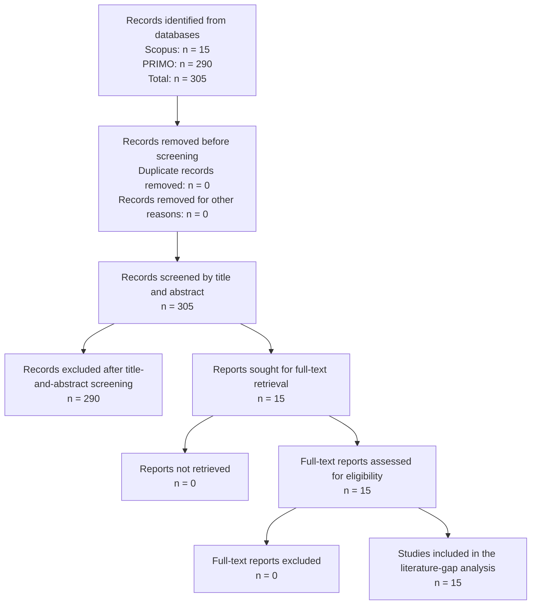

# Literature Gap Analysis

**Session 4**

## 1. Overview

The literature review examined previous research related to regulatory-document analysis, banking regulation, compliance-risk management, artificial intelligence, data protection, Regulatory Technology (RegTech), Legal Natural Language Processing, semantic embeddings, and Machine Learning-based document classification.

The purpose of the review was to determine whether previous studies had developed an artifact directly comparable to the proposed research: a Machine Learning framework capable of classifying Peruvian regulatory and institutional PDF documents as relevant or not relevant for preliminary regulatory monitoring.

The reviewed literature includes studies on:

- Legal and regulatory text classification.
- Artificial intelligence in financial regulation.
- Risk and compliance management.
- Legal-domain language models.
- Explainable classification of legal documents.
- Processing and classification of long documents.
- Semantic embeddings for text representation.
- Automated regulatory and compliance analysis.

However, the identified studies mainly address international legal corpora, court decisions, contracts, European legislation, large-scale datasets, or advanced regulatory-analysis tasks.

Within the literature reviewed, no directly comparable study was identified that integrates all the following elements:

- Peruvian regulatory and institutional PDF documents.
- Binary relevance classification.
- Spanish-language institutional content.
- Multilingual semantic embeddings.
- Fragmentation of long documents.
- Comparison of classical Machine Learning algorithms.
- Preliminary filtering before detailed regulatory review.
- PDF-quality controls and duplicate detection.

Therefore, this research addresses a contextual, methodological, and empirical gap through the design and evaluation of a reproducible regulatory-document classification artifact.

---

## 2. Literature Review Question

The literature review was guided by the following question:

> What methods have been used to analyze and classify banking, legal, regulatory, risk-management, artificial-intelligence, and data-protection documents, and what limitations remain for their application to Peruvian regulatory PDF documents?

The review also considered the following supporting questions:

1. What methods are currently used to represent and classify legal or regulatory documents?
2. How have previous studies processed documents that exceed the input limits of conventional language models?
3. Are there studies focused on Spanish-language or Latin American regulatory documents?
4. Are classical Machine Learning models still useful when combined with pretrained semantic embeddings?
5. What data-quality controls are reported before training document-classification models?

---

## 3. Information Sources

The literature search was conducted using the following academic information sources:

- **Scopus**, as a multidisciplinary abstract and citation database.
- **PRIMO**, as the institutional academic discovery and research-assistant service.

Supporting methodological and technical publications were also reviewed from recognized academic repositories and publishers when they were directly relevant to:

- PRISMA reporting.
- Legal Natural Language Processing.
- Sentence embeddings.
- Legal-domain language models.
- Long-document classification.
- Explainable legal-text classification.

---

## 4. Search Strategy

The search followed a progressive refinement strategy.

Broad searches were initially performed to identify the general research landscape. The results were subsequently narrowed through:

- Addition of specific concepts.
- Publication-year restrictions.
- Document-type filters.
- Peer-review criteria.
- Subject-area filters.
- Exclusion of unrelated domains.
- Title-and-abstract screening.
- Full-text eligibility assessment.

---

## 4.1 Scopus Search Refinement

The Scopus search began with the broad concepts of banking regulation and regulatory frameworks. Risk compliance and artificial intelligence were then added to obtain studies closer to the proposed research.

| Search ID | Search expression or focus | Applied filters | Results |
|---|---|---|---:|
| S1 | `TITLE-ABS-KEY(banking regulation AND framework)` | Publication year after 2021 | 891 |
| S2 | `TITLE-ABS-KEY(banking regulation AND framework) AND TITLE-ABS-KEY(risk compliance)` | Publication year after 2021 | 90 |
| S3 | `TITLE-ABS-KEY(banking regulation AND framework) AND TITLE-ABS-KEY(risk compliance) AND TITLE-ABS-KEY(artificial intelligence)` | Publication year after 2021 | 23 |
| S4 | Same conceptual query as S3 | Books, book chapters, and articles in press excluded | 15 |

The final Scopus search produced **15 potentially relevant records** for detailed assessment.

### Final Scopus search logic

```text
TITLE-ABS-KEY(
    banking regulation
    AND framework
)
AND TITLE-ABS-KEY(
    risk compliance
)
AND TITLE-ABS-KEY(
    artificial intelligence
)
AND PUBYEAR > 2021
AND NOT DOCTYPE("ch")
AND NOT DOCTYPE("bk")
AND NOT PUBSTAGE("aip")
```

The exact syntax may vary according to the Scopus interface, but the conceptual blocks were:

1. Banking regulation and framework.
2. Risk and compliance.
3. Artificial intelligence.
4. Publication date.
5. Document-type restrictions.

---

## 4.2 PRIMO Search Refinement

The initial PRIMO query combined concepts related to:

- Banking regulatory frameworks.
- Compliance-risk management.
- Artificial intelligence.
- Personal-data protection.
- Regulatory monitoring.
- Banking regulation.
- Design Science.
- Computer Science.

The broad query produced **91,487 results**. The result set was progressively reduced using publication type, subject area, publication status, date, and domain exclusions.

| Screening criterion | Remaining records |
|---|---:|
| Initial broad search | 91,487 |
| Design Science included | 28,563 |
| Articles and non-retracted documents | 18,309 |
| Risk factors, compliance, design, and Computer Science | 7,390 |
| Unrelated journal sources excluded | 7,296 |
| Additional unrelated subject areas excluded | 7,217 |
| Articles in review excluded | 733 |
| Employee-related studies excluded | 695 |
| Preprints excluded | 669 |
| Telecommunications excluded | 602 |
| Remaining articles in review excluded | 570 |
| Publications from 2021–2026 | 315 |
| Publications from 2022–2026 | 290 |

The refined PRIMO search produced **290 records** for title-and-abstract screening.

### Recommended PRIMO search blocks

Instead of relying on one excessively broad expression, the search was organized into complementary conceptual blocks.

#### PRIMO Search P1: Regulatory-document classification

```text
("regulatory document classification"
OR "legal document classification"
OR "regulatory text classification")
AND
("machine learning"
OR "natural language processing"
OR embeddings)
```

#### PRIMO Search P2: Banking and regulatory compliance

```text
("banking regulation"
OR "financial regulation"
OR "regulatory compliance")
AND
("machine learning"
OR "artificial intelligence"
OR RegTech)
```

#### PRIMO Search P3: Risk management and artificial intelligence

```text
("compliance risk management"
OR "regulatory risk"
OR "AI risk management")
AND
(banking OR finance)
```

#### PRIMO Search P4: Data protection and financial services

```text
("personal data protection"
OR "data privacy")
AND
(banking OR "financial systems")
AND
(regulation OR compliance)
```

#### PRIMO Search P5: Spanish and Latin American context

```text
("Spanish legal documents"
OR "Latin American regulation"
OR "Peruvian regulation")
AND
(classification
OR "machine learning"
OR embeddings)
```

These complementary searches reduced the risk of retrieving only generic studies about banking or artificial intelligence.

---

## 5. Search Terms

### English search terms

The principal English-language terms were:

- `"banking regulatory framework"`
- `"banking regulation"`
- `"financial regulation"`
- `"risk compliance"`
- `"regulatory risk"`
- `"compliance risk management"`
- `"regulatory monitoring"`
- `"regulatory document classification"`
- `"legal document classification"`
- `"long legal document classification"`
- `"artificial intelligence"`
- `"data protection"`
- `"data privacy in banking"`
- `"AI risk management"`
- `"regulatory compliance banking"`
- `"RegTech"`
- `"semantic embeddings"`
- `"Sentence Transformers"`
- `"Natural Language Processing"`
- `"Machine Learning"`
- `"Design Science"`

### Spanish search terms

Spanish-language variations included:

- `"marco regulatorio bancario"`
- `"regulación financiera"`
- `"gestión de riesgos de cumplimiento"`
- `"riesgo regulatorio"`
- `"monitoreo regulatorio"`
- `"inteligencia artificial"`
- `"protección de datos personales"`
- `"cumplimiento normativo"`
- `"clasificación de documentos jurídicos"`
- `"clasificación de documentos regulatorios"`
- `"procesamiento de lenguaje natural jurídico"`
- `"documentos legales en español"`
- `"aprendizaje automático"`

---

## 6. Inclusion Criteria

A publication was considered eligible when it met the following criteria:

- Published between 2022 and 2026 for the main recent-literature screening.
- Peer-reviewed journal article or conference paper.
- Related to banking, financial regulation, compliance, risk management, regulatory monitoring, or legal-document analysis.
- Applied Artificial Intelligence, Natural Language Processing, Machine Learning, semantic embeddings, or transformer-based methods.
- Examined legal, regulatory, financial, compliance, or institutional documents.
- Included a methodology applicable or comparable to the proposed artifact.
- Published in English or Spanish.
- Available with sufficient bibliographic, abstract, or full-text information.
- Relevant foundational studies published before 2022 were admitted when necessary to support the methodology, such as Sentence-BERT, LEGAL-BERT, Longformer, or long legal-document classification.

---

## 7. Exclusion Criteria

Publications were excluded when they met one or more of the following conditions:

- Books or book chapters.
- Retracted publications.
- Articles in press without complete results.
- Incomplete manuscripts.
- Preprints without sufficient methodological information, except when used as relevant technical foundations.
- Duplicate records retrieved from more than one source.
- Studies unrelated to legal, banking, regulatory, risk, or compliance documents.
- Studies focused exclusively on medicine, nutrition, telecommunications, or unrelated domains.
- Employee-management studies without a regulatory-document component.
- Publications without sufficient methodological information.
- Studies that only mentioned banking or artificial intelligence superficially.
- Research focused exclusively on fraud detection or transaction prediction without regulatory-document analysis.
- Publications that did not describe a data-processing, classification, retrieval, or regulatory-analysis method.

---

## 8. Literature Screening Process

The retrieved records were reviewed through the following stages:

1. Identification of records from Scopus and PRIMO.
2. Consolidation of the identified records.
3. Review for duplicate titles or DOI values.
4. Title-and-abstract screening.
5. Exclusion of records unrelated to the research objective.
6. Full-text retrieval of the retained studies.
7. Full-text eligibility assessment.
8. Selection of studies used to support the literature-gap analysis.

The process is summarized using a PRISMA 2020-style flow diagram.

---

## 9. PRISMA Flow Diagram

A total of **305 records** were considered in the consolidated screening stage:

- Scopus: 15 records.
- PRIMO: 290 records.

The PRIMO records represented the broader discovery set. After title-and-abstract screening, 290 records were excluded because they did not satisfy the complete combination of domain, methodological, and document-analysis criteria.

The 15 Scopus records constituted the final set retained for detailed literature-gap analysis.



### PRISMA Counting Table

| PRISMA stage | Number |
|---|---:|
| Records identified from Scopus | 15 |
| Records identified from PRIMO | 290 |
| Total records identified | 305 |
| Duplicate records removed | 0 |
| Records removed for other reasons before screening | 0 |
| Records screened by title and abstract | 305 |
| Records excluded by title and abstract | 290 |
| Full texts sought | 15 |
| Full texts not retrieved | 0 |
| Full texts assessed for eligibility | 15 |
| Full texts excluded | 0 |
| Studies included in the literature-gap analysis | 15 |

### Consistency verification

```text
Records screened
= Total records identified
− Duplicate records
− Other records removed

Records screened
= 305 − 0 − 0
= 305
```

```text
Reports sought for retrieval
= Records screened
− Records excluded after title-and-abstract screening

Reports sought for retrieval
= 305 − 290
= 15
```

```text
Full-text reports assessed
= Reports sought
− Reports not retrieved

Full-text reports assessed
= 15 − 0
= 15
```

```text
Studies included
= Full-text reports assessed
− Full-text reports excluded

Studies included
= 15 − 0
= 15
```

### Principal reasons for title-and-abstract exclusion

The 290 records excluded during title-and-abstract screening presented one or more of the following characteristics:

- Unrelated research domain.
- No banking, financial, regulatory, legal, or compliance context.
- No application of Machine Learning, NLP, semantic embeddings, or artificial intelligence.
- No analysis of legal, regulatory, or institutional documents.
- Exclusive focus on employee management, telecommunications, health, nutrition, or other unrelated areas.
- Focus on banking transactions without regulatory-document analysis.
- Superficial mention of banking regulation or artificial intelligence.
- Lack of methodological relevance to the proposed artifact.

---

## 10. Core Literature Supporting the Research Gap

The following studies provide the strongest methodological and conceptual support for the proposed research. They complement the 15 records retained during the screening process.

| Study | Context and data | Methodological contribution | Relationship with this research | Remaining limitation |
|---|---|---|---|---|
| Reimers and Gurevych (2019) | General semantic-text tasks | Introduced Sentence-BERT for semantically meaningful sentence embeddings and cosine-based comparison | Supports the use of Sentence Transformers for representing document fragments | Not focused on regulatory or Peruvian documents |
| Wan et al. (2019) | Long legal documents | Divided documents into segments and aggregated representations for document classification | Supports fragmentation and document-level embedding aggregation | Uses a different legal dataset and architecture |
| Beltagy, Peters, and Cohan (2020) | Long textual documents | Proposed Longformer to process longer sequences using sparse attention | Demonstrates the input-length problem of conventional transformers | More computationally complex than the proposed prototype |
| Chalkidis et al. (2020) | Legal corpora and downstream legal tasks | Developed LEGAL-BERT models adapted to legal-domain text | Demonstrates the value of domain-specific language representation | Primarily trained on English-language legal corpora |
| Pappagari et al. (2019) | Long, domain-specific documents | Proposed hierarchical transformer approaches for long-document classification | Supports segment-level processing followed by document-level aggregation | Not focused on regulatory relevance filtering |
| Park, Vyas, and Shah (2022) | Multiple long-document datasets | Compared transformer methods and simpler baselines | Supports comparing complex methods against strong classical baselines | Does not address Peruvian institutional documents |
| Mamakas et al. (2022) | Long legal documents | Compared LegalBERT, Longformer, and alternative long-text representations | Supports the need to balance performance and computational cost | Focused on established legal benchmarks |
| de Arriba-Pérez et al. (2022/2024) | Spanish legal judgments | Applied explainable multi-label Machine Learning to Spanish legal texts | Provides evidence that Spanish legal texts can be classified automatically | Focuses on judgments rather than regulatory PDFs |
| González-González et al. (2024) | Spanish legal judgments | Combined NLP, tree estimators, and explainable decisions | Supports the comparison of interpretable classical ML methods | Addresses legal categories rather than binary regulatory relevance |
| Han, Tsao, and Huang (2024) | Long documents from law and health | Proposed a length-aware transformer and analyzed variation in document length | Reinforces the difficulty of classifying documents of heterogeneous length | Requires a more complex architecture and larger benchmarks |

---

## 11. Synthesis of the Reviewed Literature

The reviewed studies demonstrate that legal and regulatory documents can be processed through NLP and Machine Learning techniques. They also show that document length, specialized vocabulary, explainability, language, and dataset size influence model performance.

Several consistent observations emerge:

1. Legal and regulatory documents contain specialized terminology.
2. Long documents frequently exceed the input length of conventional transformer models.
3. Fragmentation and hierarchical aggregation are common strategies.
4. Legal-domain pretrained models can improve specialized legal tasks.
5. Complex architectures do not always outperform simpler baselines consistently.
6. Spanish legal-document classification remains less represented than English-language legal NLP.
7. Existing studies generally focus on judgments, contracts, legislation, or compliance requirements rather than preliminary document relevance.
8. Limited evidence was identified for Peruvian regulatory-document classification.

These observations support the use of:

- Overlapping document chunks.
- Multilingual semantic embeddings.
- Document-level vector aggregation.
- Classical Machine Learning models.
- Multiple evaluation metrics.
- Explicit data-quality controls.

---

# 12. Identified Gaps

## Gap 1: Limited Evidence in the Peruvian Regulatory Context

The reviewed literature primarily examines financial, legal, and regulatory applications in international contexts.

The identified studies address:

- European legislation.
- International banking.
- Spanish court judgments.
- Contracts.
- Emerging economies.
- General legal corpora.
- Responsible AI.
- Cybersecurity.
- Financial-risk frameworks.

However, no directly comparable artifact was identified that had been trained and evaluated using PDF documents issued by Peruvian regulatory and institutional entities.

### Significance

International models may not directly represent:

- Peruvian regulatory terminology.
- Spanish-language institutional expressions.
- Local regulatory-document structures.
- References to the Peruvian payment system.
- Risk-management terminology used by the SBS.
- Payment-system terminology used by the BCRP.
- Digital-transformation terminology used by the PCM.
- Institutional writing styles of Peruvian public authorities.

### How This Research Addresses the Gap

The research constructs a specialized dataset using Peruvian institutional PDF documents related to:

- Payment systems.
- Risk management.
- Artificial intelligence.
- Personal-data protection.
- Digital transformation.

The proposed artifact evaluates whether these documents can be automatically differentiated from non-relevant institutional documents.

---

## Gap 2: Limited Research on Preliminary Relevance Filtering

A significant part of the literature focuses on advanced activities such as:

- Regulatory-report generation.
- Compliance interpretation.
- Legal prediction.
- Risk quantification.
- Explainable AI.
- Cybersecurity assessment.
- Credit-scoring regulation.
- Responsible-AI governance.
- Obligation and requirement extraction.

These activities generally assume that the relevant legal or regulatory documents have already been identified.

Less attention is given to the preliminary operational question:

> Should a newly received document be reviewed in detail, or can it be excluded from the initial regulatory-monitoring process?

### Significance

Before extracting obligations, deadlines, sanctions, responsible entities, or compliance requirements, institutions need to identify which documents deserve detailed human review.

Without preliminary filtering, organizations may experience:

- Excessive manual workload.
- Delayed regulatory analysis.
- Inconsistent prioritization.
- Review of documents unrelated to the monitoring objective.
- Greater risk of overlooking relevant regulatory information.

### How This Research Addresses the Gap

The proposed artifact performs binary document classification:

- `1`: Relevant.
- `0`: Not relevant.

It functions as an initial filtering mechanism before detailed legal, regulatory, or compliance analysis.

---

## Gap 3: Limited Practical Approaches for Long Documents and Small Datasets

Regulatory documents are often long and may exceed the input limits of conventional language models.

At the same time, specialized Peruvian regulatory datasets may initially contain relatively few manually labeled documents.

Many published approaches rely on:

- Large legal corpora.
- Domain-specific transformer training.
- Complex neural architectures.
- Extensive computational resources.
- Established benchmark datasets.

### Significance

These requirements may not be suitable for an initial institutional prototype characterized by:

- A small labeled dataset.
- Unequal quantities per topic.
- Documents with heterogeneous lengths.
- Limited computing resources.
- No established Peruvian regulatory benchmark.
- Need for simple reproduction in Google Colab.

### How This Research Addresses the Gap

The proposed framework applies the following lightweight and reproducible process:

1. PDF text extraction.
2. Text validation and cleaning.
3. Fragmentation into overlapping chunks.
4. Multilingual semantic embedding generation.
5. Average aggregation into one document vector.
6. Classification using classical Machine Learning models.

The study compares:

- Logistic Regression.
- Linear Support Vector Machine.
- Random Forest.

---

## Gap 4: Insufficient Attention to PDF and Dataset Quality Controls

Document-classification research frequently emphasizes predictive performance, while practical data-quality issues may receive less explicit attention.

These issues include:

- PDF files without extractable text.
- Scanned or image-based documents.
- Text extraction failures.
- Duplicate documents.
- Documents with insufficient content.
- Conflicting labels.
- Information leakage between training and testing.

### Significance

Data-quality problems can produce misleading evaluation results.

For example, duplicate documents distributed between training and testing can artificially increase accuracy and other evaluation metrics.

### How This Research Addresses the Gap

The project includes:

- Primary PDF extraction using PyMuPDF.
- Alternative extraction using `pypdf`.
- Exclusion only after both extraction attempts fail.
- Exact duplicate detection using SHA-256 text hashes.
- Duplicate removal before dataset division.
- Stratified train-test separation.
- Verification that no document is shared between training and testing.
- Validation of missing and infinite embedding values.

---

## Gap 5: Limited Comparison of Classical Models Using Multilingual Embeddings

Recent research frequently emphasizes large transformer architectures and specialized legal-language models.

However, these methods may require:

- Large labeled datasets.
- Extensive hyperparameter optimization.
- Greater computing capacity.
- Higher implementation complexity.
- Longer training times.

For a small specialized dataset, classical models combined with pretrained multilingual embeddings may provide a simpler and more reproducible alternative.

### Significance

Complex models can:

- Overfit small datasets.
- Increase execution time.
- Reduce reproducibility.
- Be difficult to maintain.
- Provide limited additional benefit over strong baselines.

### How This Research Addresses the Gap

The research uses the same multilingual document embeddings to train and compare:

- Logistic Regression.
- Linear SVM.
- Random Forest.

The evaluation includes:

- Accuracy.
- Precision.
- Recall.
- F1-score.
- ROC-AUC.
- Confusion matrices.

---

# 13. Theoretical Gaps

The reviewed literature provides theoretical foundations in:

- Legal Natural Language Processing.
- Regulatory Technology.
- Financial-compliance management.
- Artificial-intelligence governance.
- Semantic text representation.
- Legal-domain language modeling.
- Automated document classification.
- Long-document processing.

However, limited integration was identified between:

- Regulatory monitoring as an organizational process.
- Preliminary relevance classification.
- Semantic representation of long PDF documents.
- Small Spanish-language institutional datasets.
- Design Science as a framework for constructing and evaluating the artifact.

This research links these areas by treating the classification pipeline as a Design Science artifact intended to support regulatory-monitoring activities.

---

# 14. Methodological Gaps

The following methodological gaps were identified:

- Limited use of reproducible pipelines for small Spanish-language regulatory datasets.
- Limited comparison of classical classifiers using identical multilingual embeddings.
- Insufficient documentation of PDF text-extraction failures.
- Limited reporting of alternative extraction attempts.
- Insufficient duplicate control before train-test separation.
- Limited reporting of data-leakage verification.
- Limited use of binary relevance classification as a preliminary regulatory-monitoring step.
- Limited evaluation of lightweight solutions suitable for institutional prototypes.

This research addresses these gaps through a documented and reproducible Google Colab pipeline.

---

# 15. Empirical Gaps

The reviewed literature provides limited empirical evidence involving:

- Peruvian regulatory PDF documents.
- Documents issued by the BCRP, SBS, PCM, and data-protection-related authorities.
- Spanish-language documents concerning payment systems and risk management.
- Small and specialized regulatory datasets.
- Relevant and non-relevant institutional documents.
- Hard-negative documents that contain related vocabulary but address a different principal topic.
- Classification of external PDFs using models trained with Peruvian institutional documents.

This research contributes initial empirical evidence through an organized and manually labeled dataset of Peruvian institutional PDF documents.

---

# 16. Contribution of This Research

This research contributes:

1. A specialized dataset of relevant and non-relevant institutional PDF documents.
2. A documented process for PDF text extraction and validation.
3. An alternative extraction attempt for documents without accessible text.
4. A duplicate-detection mechanism based on SHA-256 document-content hashes.
5. A fragmentation strategy for processing long PDF documents.
6. Multilingual semantic embeddings for document representation.
7. A comparison of three supervised Machine Learning models.
8. Evaluation through multiple classification metrics.
9. A functional process for classifying a previously unseen PDF.
10. An initial artifact for supporting regulatory-document prioritization in Peru.
11. A reproducible implementation using Google Colab and Google Drive.

The proposed artifact does not replace legal, regulatory, risk, or compliance specialists.

Its purpose is to support the preliminary identification and prioritization of documents that may require detailed human review.

---

# 17. Limitations of the Literature Review

The literature review presents the following limitations:

- It used Scopus and PRIMO rather than every available academic database.
- Some relevant studies may exist in local or non-indexed repositories.
- Proprietary banking RegTech implementations may not be publicly documented.
- Search-result counts may change when new publications are indexed.
- Search expressions may produce different results depending on institutional database access.
- The PRIMO result set was broad and required substantial title-and-abstract filtering.
- The screening was conducted for an academic project and was not independently reviewed by a second researcher.
- The absence of an identified study must not be interpreted as proof that no comparable implementation exists.
- Some foundational studies were published before the recent-period filter but were included because of their methodological relevance.

Therefore, the literature gap is stated only in relation to the publications reviewed and the search strategy applied in this study.

---

# 18. Conclusion of the Gap Analysis

The literature demonstrates that Machine Learning, NLP, semantic embeddings, and transformer-based models can support legal and regulatory-document analysis.

Nevertheless, the reviewed studies do not fully address the combination of:

- Peruvian regulatory documents.
- Spanish-language institutional PDFs.
- Preliminary binary relevance classification.
- Small labeled datasets.
- Long-document fragmentation.
- Multilingual embeddings.
- Classical-model comparison.
- Explicit PDF and dataset-quality controls.

The proposed artifact responds to this gap by providing a practical and reproducible prototype for prioritizing documents before detailed regulatory review.

---

# 19. References

Beltagy, I., Peters, M. E., and Cohan, A. (2020). Longformer: The Long-Document Transformer. *arXiv preprint arXiv:2004.05150*.

Chalkidis, I., Fergadiotis, M., Malakasiotis, P., Aletras, N., and Androutsopoulos, I. (2020). LEGAL-BERT: The Muppets straight out of Law School. *Findings of the Association for Computational Linguistics: EMNLP 2020*, 2898–2904.

de Arriba-Pérez, F., García-Méndez, S., González-Castaño, F. J., and González-González, J. (2022). Explainable Machine Learning Multi-label Classification of Spanish Legal Judgements. *Journal of King Saud University – Computer and Information Sciences, 34*, 10180–10192.

González-González, J., de Arriba-Pérez, F., García-Méndez, S., Busto-Castiñeira, A., and González-Castaño, F. J. (2024). Automatic Explanation of the Classification of Spanish Legal Judgments in Jurisdiction-Dependent Law Categories with Tree Estimators. *arXiv preprint arXiv:2404.00437*.

Han, G., Tsao, J., and Huang, X. (2024). Length-Aware Multi-Kernel Transformer for Long Document Classification. *arXiv preprint arXiv:2405.07052*.

Mamakas, D., Tsotsi, E., Androutsopoulos, I., and Chalkidis, I. (2022). Processing Long Legal Documents with Pre-trained Transformers: Modding LegalBERT and Longformer. *arXiv preprint arXiv:2211.00974*.

Page, M. J., McKenzie, J. E., Bossuyt, P. M., Boutron, I., Hoffmann, T. C., Mulrow, C. D., et al. (2021). The PRISMA 2020 Statement: An Updated Guideline for Reporting Systematic Reviews. *BMJ, 372*, n71.

Pappagari, R., Zelasko, P., Villalba, J., Carmiel, Y., and Dehak, N. (2019). Hierarchical Transformers for Long Document Classification. *2019 IEEE Automatic Speech Recognition and Understanding Workshop*, 838–844.

Park, H. H., Vyas, Y., and Shah, K. (2022). Efficient Classification of Long Documents Using Transformers. *arXiv preprint arXiv:2203.11258*.

Reimers, N., and Gurevych, I. (2019). Sentence-BERT: Sentence Embeddings Using Siamese BERT-Networks. *Proceedings of the 2019 Conference on Empirical Methods in Natural Language Processing and the 9th International Joint Conference on Natural Language Processing*, 3982–3992.

Wan, L., Papageorgiou, G., Seddon, M., and Bernardoni, M. (2019). Long-length Legal Document Classification. *arXiv preprint arXiv:1912.06905*.
