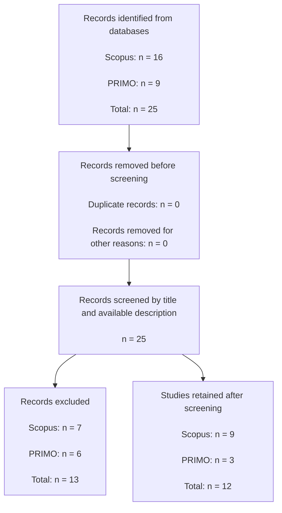

# Literature Gap Analysis

**Session 4**

## 1. Overview

The literature review examined previous research related to document processing, and Machine Learning-based document classification.banking regulation, compliance-risk management, artificial intelligence, Regulatory framework.

The purpose of the review was to determine whether previous studies had developed an artifact directly comparable to the proposed research: a Machine Learning framework capable of classifying Peruvian regulatory and institutional PDF documents as relevant or not relevant for preliminary regulatory monitoring and then continue with second part design and implementation.

The reviewed literature demonstrates that Artificial Intelligence can support:

- Regulatory-document classification.
- Regulatory-text analysis.
- Compliance monitoring.
- Classification of long legal documents.
- Automated document review.
- Analysis of regulatory and financial information.

Nevertheless, most identified studies focus on international banking contexts, European regulation, court judgments, contracts, credit-risk applications, financial forecasting, responsible AI, or general compliance frameworks.

Within the literature reviewed, no directly comparable study was identified that combines:

- Peruvian regulatory and institutional PDF documents.
- Binary relevance classification.
- Spanish-language institutional content.
- Fragmentation of long PDF documents.
- Comparison of classical Machine Learning algorithms.
- Preliminary filtering before detailed regulatory review.

Therefore, this research addresses a contextual, methodological, and empirical gap through the design and evaluation of a reproducible regulatory-document classification artifact.

---

## 2. Literature Review Question

The literature review was guided by the following question:

> What methods have been used to analyze and classify banking, legal, regulatory, compliance, risk-management, and artificial-intelligence documents, and what limitations remain for their application to Peruvian regulatory PDF documents?

The following supporting questions were considered:

1. What methods are used to represent and classify legal or regulatory documents?
2. What evidence exists for Spanish-language or multilingual legal classification?
3. Can classical Machine Learning models remain useful when combined with pretrained semantic embeddings?
4. What data-quality controls are applied before training document-classification models?
5. Is preliminary document-relevance filtering addressed before detailed compliance analysis?

---

## 3. Information Sources

The literature discovery process used:

- **PRIMO**, the institutional academic-discovery service.
- **Scopus**, a multidisciplinary abstract and citation database.

Supporting methodological studies were also consulted from recognized academic repositories and publisher records when they were directly relevant to:

- Semantic embeddings.
- Legal-domain language models.
- Multilingual legal classification.
- Long-document classification.
- Regulatory text analysis.


---

## 4. Search Strategy

A focused search strategy was applied to identify studies at the intersection of:

1. Banking regulation.
2. Compliance risk.
3. Artificial intelligence.
4. Machine Learning.

The principal conceptual expression was:

```text
("banking regulation framework"
AND "compliance risk"
AND "artificial intelligence")
AND "machine learning"
```

The same conceptual blocks were applied in PRIMO and Scopus, adapting the syntax to the search interface of each database.
The query was intentionally.

---

## PRISMA Flow Diagram



## Reasons for Exclusion

| Main reason | Number |
|---|---:|
| General conference proceedings or books without a specific study | 3 |
| Unrelated historical or economic domain | 2 |
| Customer service or complaint classification | 2 |
| General review of AI, FinTech, or blockchain | 3 |
| Unrelated domain, such as patents | 1 |
| No clearly applicable document-classification methodology | 2 |
| **Total excluded** | **13** |

## Studies Retained from Scopus

| No. | Study |
|---:|---|
| 1 | *Cross-Document Emotion Consistency: A Feature Family Framework for Financial Disclosure Risk Screening* |
| 5 | *Artificial Intelligence and Large Language Models in Government Document Management* |
| 6 | *Role of AI in Enterprise Content Management* |
| 7 | *Transforming Records Management in South Africa* |
| 8 | *Analysis on Word Embedding and Classifier Models in Legal Analytics* |
| 9 | *BBRC: Brazilian Banking Regulation Corpora* |
| 10 | *Automated Multi-Page Document Classification and Information Extraction for Insurance Applications* |
| 15 | *A Complete Process of Text Classification System Using State-of-the-Art NLP Models* |
| 16 | *Identifying Banking Transaction Descriptions via Support Vector Machine Short-Text Classification* |

## Studies Retained from PRIMO

| No. | Study |
|---:|---|
| 1 | *Specialized Text Classification: An Approach to Classifying Open Banking Transactions* |
| 2 | *Predicting Firm Financial Performance from SEC Filing Changes Using Automatically Generated Dictionary* |
| 3 | *Banking Regulation Classification in Portuguese* |

### Summary of the Selection Process

A total of 25 records were identified, including 16 records from Scopus and 9 records from PRIMO. No exact duplicate publications were found. After reviewing the titles and available descriptions, 13 records were excluded because they focused on unrelated domains, general conference proceedings, customer service, fraud detection, historical analysis, or topics without a clearly applicable document-classification method.

Consequently, 12 studies were retained for the literature review: 9 from Scopus and 3 from PRIMO.

### Main Studies Supporting the Methodological Foundation

The following studies present the strongest relationship with the developed artifact:

| Study | Project component supported |
|---|---|
| *BBRC: Brazilian Banking Regulation Corpora* | Construction and analysis of a banking-regulation corpus |
| *Banking Regulation Classification in Portuguese* | Classification of banking regulatory documents |
| *Analysis on Word Embedding and Classifier Models in Legal Analytics* | Use of embeddings and classification models in legal texts |
| *Automated Multi-Page Document Classification and Information Extraction for Insurance Applications* | Processing and classification of long, multi-page documents |
| *A Complete Process of Text Classification System Using State-of-the-Art NLP Models* | General design of a complete text-classification pipeline |
| *Artificial Intelligence and Large Language Models in Government Document Management* | Application of Artificial Intelligence to institutional document management |

### Interpretation

The most closely related studies show that the automatic classification of legal, banking, and institutional documents can be addressed through Natural Language Processing techniques, semantic representations, and supervised models.

The studies on banking regulation in Brazil and Portuguese-language regulatory classification are especially relevant because they provide contexts close to the problem addressed in this research. However, based on the available titles and descriptions, none of them appears to address exactly the same combination proposed in this project:

- Peruvian regulatory and institutional documents.
- Binary classification into relevant and not relevant.
- Processing of long PDF documents.
- Overlapping text fragmentation.
- Use of multilingual embeddings.
- Comparison of Logistic Regression, linear SVM, and Random Forest.
- Validation of text extraction.
- Exclusion of documents without usable textual content.
- Detection and removal of duplicate documents.

Therefore, the selected studies provide methodological and contextual background, while the application to the Peruvian regulatory environment represents the specific contribution of this research.

## References

Bura, C., Jonnalagadda, A. K., Naayini, P., Kamatala, S., & Myakala, P. K. (2025). Role of AI in enterprise content management: Foundations and current state. In *2025 Global Conference in Emerging Technology (GINOTECH)*. IEEE. https://doi.org/10.1109/GINOTECH63460.2025.11076659

de Azevedo, R. F., Muniz, T. H. E., Pimentel, C., Macedo, B. C., de Lima Vasconcelos, D., et al. (2024). BBRC: Brazilian Banking Regulation Corpora. In *Proceedings of the Joint Workshop of the 7th Financial Technology and Natural Language Processing, the 5th Knowledge Discovery from Unstructured Data in Financial Services, and the 4th Economics and Natural Language Processing Workshop at LREC-COLING 2024*.

de Azevedo, R. F., Silva, T. N., Augusto, H. T. B. V., Reis, P. O. S., Chaves, I. B., et al. (2022). Banking regulation classification in Portuguese. In *Computational Processing of the Portuguese Language: 15th International Conference, PROPOR 2022* (pp. 137–147). Springer. https://doi.org/10.1007/978-3-030-98305-5_13

Dogra, V., Verma, S., Kavita, Chatterjee, P., Shafi, J., Choi, J., & Ijaz, M. F. (2022). A complete process of text classification system using state-of-the-art NLP models. *Computational Intelligence and Neuroscience, 2022*, Article 1883698. https://doi.org/10.1155/2022/1883698

García-Méndez, S., Fernández-Gavilanes, M., Juncal-Martínez, J., González-Castaño, F. J., & Seara, O. B. (2020). Identifying banking transaction descriptions via support vector machine short-text classification based on a specialized labelled corpus. *IEEE Access, 8*, 61642–61655. https://doi.org/10.1109/ACCESS.2020.2983584

Gupta, A., Rawte, V., & Zaki, M. J. (2024). Predicting firm financial performance from SEC filing changes using automatically generated dictionary. *Computational Economics, 64*(1), 307–334. https://doi.org/10.1007/s10614-023-10443-x

McCarthy, S., & Alaghband, G. (2026). Cross-document emotion consistency (CDEC): A feature family framework for financial disclosure risk screening. *Journal of Risk and Financial Management, 19*(4), Article 251. https://doi.org/10.3390/jrfm19040251

Schellnack-Kelly, I. (2025). Transforming records management in South Africa: The role of AI in dynamic file plan development. *New Review of Information Networking, 30*(2), 227–256. https://doi.org/10.1080/13614576.2025.2570662

Singh, R., Sharma, V., Kashyap, R., & Manwal, M. (2024). Automated multi-page document classification and information extraction for insurance applications using deep learning techniques. In *2024 11th International Conference on Reliability, Infocom Technologies and Optimization: Trends and Future Directions (ICRITO)* (pp. 1–7). IEEE. https://doi.org/10.1109/ICRITO61523.2024.10522111

Sukanya, G., & Priyadarshini, J. (2024). Analysis on word embedding and classifier models in legal analytics. *AIP Conference Proceedings, 2802*(1), Article 140001. https://doi.org/10.1063/5.0181820

Ta, D. T., Ben Saad, W., & Oh, J. Y. (2023). Specialized text classification: An approach to classifying Open Banking transactions. In *2023 IEEE 18th International Conference on Computer Science and Information Technologies (CSIT)* (pp. 1–4). IEEE. https://doi.org/10.1109/CSIT61576.2023.10324203

Yang, H., Nawi, H. S. A., & Zhang, Y. (2025). Artificial intelligence and large language models in government document management: A systematic review of applications, challenges, and implementation strategies. *Journal of Logistics, Informatics and Service Science, 12*(4), 129–145. https://doi.org/10.33168/JLISS.2025.0408

