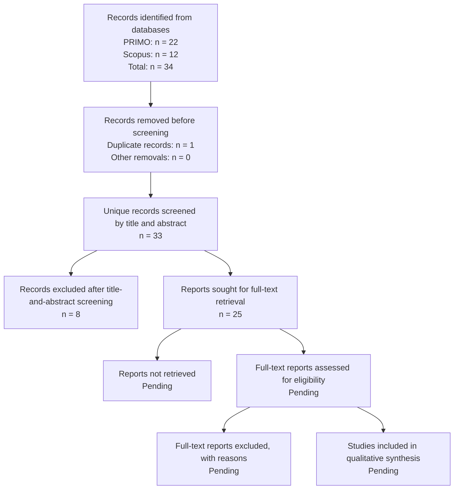

# Systematic Literature Review

**Session 4**

## 1. Overview

This Systematic Literature Review examines research related to banking regulation, regulatory compliance, risk management, Artificial Intelligence, Legal Natural Language Processing, semantic embeddings, and automated document classification.

The review supports the development of a Machine Learning artifact for classifying Peruvian regulatory and institutional PDF documents as:

- **Relevant**.
- **Not relevant**.

The review has two main purposes:

1. To identify methods previously used to analyze and classify legal, banking, regulatory, and compliance-related documents.
2. To determine which methodological and contextual limitations justify the proposed research artifact.

The review follows a PRISMA-inspired selection process covering:

1. Identification of records.
2. Duplicate checking.
3. Title-and-abstract screening.
4. Full-text eligibility assessment.
5. Qualitative synthesis.
6. Identification of literature gaps.

The review is currently considered a focused academic systematic review in progress because the formal screening of all identified records has not yet been completed.

---

# 2. Review Objective

The objective of this review is:

> To identify and analyze previous methods for automatically processing, representing, and classifying legal, banking, regulatory, and compliance-related documents, with particular attention to their applicability to Peruvian regulatory PDF documents.

The review also evaluates whether existing literature addresses:

- Preliminary document-relevance filtering.
- Spanish-language regulatory documents.
- Long-document processing.
- Small specialized datasets.
- Multilingual semantic embeddings.
- Classical Machine Learning classifiers.
- PDF-quality and duplicate controls.

---

# 3. Research Questions Informing the Review

## RQ1: Document-classification methods

> What Machine Learning and Natural Language Processing methods have been used to classify legal, banking, regulatory, or compliance-related documents?

This question examines:

- Traditional Machine Learning.
- Transformer models.
- Legal-domain language models.
- Semantic embeddings.
- Multi-label and binary classification.
- Explainable classification methods.

---

## RQ2: Long-document processing

> How have previous studies processed legal or regulatory documents whose length exceeds the input limits of conventional language models?

This question examines:

- Document segmentation.
- Sliding windows.
- Overlapping chunks.
- Hierarchical architectures.
- Sparse-attention transformers.
- Embedding aggregation.
- Document-level vector construction.

---

## RQ3: Regulatory relevance filtering

> To what extent has previous research addressed preliminary relevance classification before detailed legal or compliance analysis?

This question distinguishes between:

- Initial document filtering.
- Legal-topic classification.
- Obligation extraction.
- Compliance-rule interpretation.
- Regulatory reporting.
- Risk quantification.

---

## RQ4: Language and geographical context

> What evidence exists for Spanish-language, Latin American, or Peruvian legal and regulatory document classification?

This question evaluates:

- Spanish legal-document datasets.
- Multilingual legal benchmarks.
- Latin American applications.
- Peruvian institutional documents.
- Country-specific legal terminology.

---

## RQ5: Small datasets and model complexity

> What methods are suitable for specialized regulatory-document classification when only a relatively small labeled dataset is available?

This question considers:

- Transfer learning.
- Pretrained embeddings.
- Classical Machine Learning.
- Lightweight models.
- Overfitting risks.
- Reproducibility.
- Computational cost.

---

## RQ6: Data-quality controls

> What document and dataset quality controls are reported before legal or regulatory classification models are trained?

This question examines:

- PDF extraction failures.
- Documents without extractable text.
- Duplicate records.
- Label quality.
- Insufficient textual content.
- Train-test leakage.
- Missing or invalid numerical values.

---

# 4. Review Protocol

The literature-review protocol was defined before completing the final synthesis.

It specifies:

- Research questions.
- Databases.
- Search expressions.
- Date restrictions.
- Inclusion criteria.
- Exclusion criteria.
- Screening stages.
- Information to extract.
- Quality-assessment criteria.
- Synthesis strategy.

The protocol was designed to improve transparency and reduce arbitrary study selection.

---

# 5. Information Sources

The principal databases used were:

- **PRIMO**, the institutional academic-discovery service.
- **Scopus**, a multidisciplinary abstract and citation database.

Complementary methodological studies were consulted through:

- ACL Anthology.
- arXiv.
- ScienceDirect.
- Journal and publisher websites.
- Official PRISMA resources.
- DOI and bibliographic metadata services.

The complementary sources were used to verify:

- Publication title.
- Authors.
- Publication year.
- Venue.
- Methodology.
- Dataset.
- Main findings.
- Relationship with the proposed research.

---

# 6. Search Period

The principal database search covered publications between:

```text
1 January 2021 and 31 December 2026
```

Earlier foundational publications were accepted when they were necessary to justify:

- Sentence embeddings.
- Legal-domain language models.
- Long-document processing.
- Hierarchical document classification.
- Systematic-review reporting.

Examples include Sentence-BERT, LEGAL-BERT, Longformer, and early long legal-document classification studies.

---

# 7. Search Strategy

The principal search combined four conceptual blocks:

1. Banking regulation.
2. Compliance risk.
3. Artificial Intelligence.
4. Machine Learning.

The general search expression was:

```text
("banking regulation framework"
AND "compliance risk"
AND "artificial intelligence")
AND "machine learning"
```

The syntax was adapted according to the interface of PRIMO and Scopus.

---

## 7.1 PRIMO Search

### Search fields

| Parameter | Configuration |
|---|---|
| Search scope | Search all |
| First field | Any field |
| First expression | `Banking regulation framework AND Compliance risk AND Artificial Intelligence` |
| Boolean connection | AND |
| Second field | Any field |
| Second expression | `machine learning` |
| Initial material type | All items |
| Initial language filter | No restriction |
| Start date | 1 January 2021 |
| End date | 31 December 2026 |

### PRIMO result

The search produced:

```text
22 records
```

The records addressed areas such as:

- AI-supported banking.
- Automated credit assessment.
- Banking governance.
- Financial-risk management.
- Cybersecurity.
- Data sovereignty.
- Digital transformation.
- Compliance.
- Financial decision-making.

Not every retrieved result was directly related to regulatory-document classification. The records must therefore be evaluated through title-and-abstract screening.

---

## 7.2 Scopus Search

The Scopus search was conducted across:

- Article titles.
- Abstracts.
- Keywords.

The conceptual expression was:

```text
Banking regulation framework
AND risk compliance
AND artificial intelligence
AND machine learning
```

### Applied Scopus filters

| Filter | Configuration |
|---|---|
| Search field | Article title, abstract, and keywords |
| Document type | Article |
| Publication years displayed | 2025–2026 |
| Preprints | Excluded from the 12-document result |
| Results displayed | English-language records |

### Scopus result

The search produced:

```text
12 records
```

The records included topics such as:

- Responsible AI in finance.
- European AI Act compliance.
- Internal auditing of AI risks.
- Personal-data protection.
- Credit-scoring regulation.
- Data sovereignty.
- Islamic-finance regulation.
- Banking performance.
- Digital transformation.
- Financial-risk governance.

---

## 7.3 Consolidated Search Results

| Database | Records identified |
|---|---:|
| PRIMO | 22 |
| Scopus | 12 |
| **Total before duplicate checking** | **34** |

The total of 34 represents the records returned before identifying titles or DOI values that may appear in both databases.

---

# 8. Complementary Search Expressions

Because the principal query focused strongly on banking, additional searches were defined to locate methodological research.

## Search A: Regulatory-document classification

```text
"regulatory document classification"
AND "machine learning"
```

## Search B: Legal-document classification

```text
"legal document classification"
AND
("machine learning" OR "natural language processing")
```

## Search C: Long legal documents

```text
"long legal document classification"
```

## Search D: Semantic embeddings

```text
("sentence embeddings" OR "semantic embeddings")
AND "legal document classification"
```

## Search E: Regulatory compliance

```text
"regulatory compliance"
AND
("natural language processing" OR "machine learning")
```

## Search F: Spanish legal classification

```text
"Spanish legal document classification"
```

## Search G: Latin America and Peru

```text
("Latin American regulation" OR "Peruvian regulation")
AND
("machine learning" OR classification)
```

These searches provide methodological evidence that may not appear in a narrowly focused banking query.

---

# 9. Search Terms and Keywords

## Banking and regulation

- `"banking regulation"`
- `"banking regulation framework"`
- `"financial regulation"`
- `"regulatory framework"`
- `"regulatory monitoring"`
- `"regulatory compliance"`
- `"RegTech"`

## Risk and compliance

- `"compliance risk"`
- `"risk compliance"`
- `"compliance risk management"`
- `"regulatory risk"`
- `"risk management"`

## Artificial Intelligence and Machine Learning

- `"artificial intelligence"`
- `"machine learning"`
- `"natural language processing"`
- `"semantic embeddings"`
- `"sentence embeddings"`
- `"Sentence-BERT"`
- `"transformer models"`

## Legal and regulatory documents

- `"legal document classification"`
- `"regulatory document classification"`
- `"regulatory text classification"`
- `"long legal document"`
- `"legal text classification"`
- `"document relevance"`
- `"legal document review"`

## Language and geographical context

- `"Spanish legal documents"`
- `"Latin American regulation"`
- `"Peruvian regulation"`
- `"documentos regulatorios peruanos"`
- `"clasificación de documentos jurídicos"`
- `"clasificación de documentos regulatorios"`

---

# 10. Inclusion Criteria

A record is eligible when it meets the following criteria:

1. It is a journal article or conference paper.
2. It is related to at least one of the following:
   - Banking regulation.
   - Financial regulation.
   - Compliance.
   - Regulatory risk.
   - Legal documents.
   - Institutional documents.
3. It applies or evaluates:
   - Machine Learning.
   - Natural Language Processing.
   - Semantic embeddings.
   - Transformer models.
   - Information retrieval.
   - Automated document analysis.
4. It contains sufficient methodological information.
5. It is available in English or Spanish.
6. It contributes to at least one project component:
   - PDF classification.
   - Preliminary relevance filtering.
   - Long-document processing.
   - Multilingual representation.
   - Regulatory monitoring.
   - Model evaluation.
7. It was published between 2021 and 2026, except for essential foundational publications.

---

# 11. Exclusion Criteria

A record is excluded when:

1. It has no relationship with regulation, compliance, banking, legal documents, or institutional documents.
2. It contains no Machine Learning, NLP, retrieval, or document-analysis methodology.
3. It focuses exclusively on:
   - Fraud detection.
   - Credit scoring.
   - Customer churn.
   - Stock-market prediction.
   - Financial forecasting.
   - Banking performance.
   
   without analyzing regulatory or legal texts.
4. It only mentions Artificial Intelligence or regulation superficially.
5. It is a duplicate by title or DOI.
6. It is a book, editorial, or incomplete publication without direct methodological relevance.
7. It lacks sufficient abstract or methodological information.
8. It belongs to an unrelated domain.
9. Its full text cannot be obtained and the abstract is insufficient for evaluation.
10. It does not contribute to any of the research questions.

---

# 12. Duplicate Detection

The 22 records identified through PRIMO and the 12 records identified through Scopus were consolidated into a single preliminary screening set.

Duplicates were identified using:

1. DOI.
2. Normalized publication title.
3. Authors and publication year when a DOI was unavailable.

The normalized title was:

- Converted to lowercase.
- Stripped of punctuation.
- Normalized for repeated whitespace.
- Compared while ignoring minor formatting differences.

One duplicate publication was identified:

| Scopus record | PRIMO record | Decision |
|---:|---:|---|
| 8 | 7 | One copy retained; one duplicate removed |

Although the duplicated study was also not directly aligned with the proposed regulatory-document classification task, it was counted only as a duplicate removed before screening. It was not counted again among the title-and-abstract exclusions.

### Duplicate-removal result

| Item | Number |
|---|---:|
| Records before duplicate checking | 34 |
| Duplicate records removed | 1 |
| Unique records remaining | 33 |

---

# 13. Screening Procedure

The review followed the stages below.

## Stage 1: Identification

Records were identified from:

| Database | Records |
|---|---:|
| PRIMO | 22 |
| Scopus | 12 |
| **Total** | **34** |

---

## Stage 2: Duplicate Removal

One duplicated study appeared in both databases.

```text
Duplicate records removed: 1
```

After duplicate removal:

```text
Unique records: 33
```

---

## Stage 3: Title-and-Abstract Screening

The titles and available abstracts of the 33 unique records were reviewed according to the inclusion and exclusion criteria.

The following decisions were available:

- `Include`.
- `Exclude`.
- `Uncertain`.

A record was excluded when its principal objective was not related to regulatory-document analysis, legal-document classification, compliance-document processing, or a directly applicable methodology.

### Records excluded during title-and-abstract screening

| Database | Record ID | Main focus | Decision | Exclusion reason |
|---|---:|---|---|---|
| Scopus | 2 | Responsible AI capabilities in finance | Exclude | General responsible-AI study without regulatory-document classification |
| Scopus | 3 | Credit scoring under European Union law | Exclude | Focused on credit scoring rather than document relevance classification |
| Scopus | 11 | Artificial Intelligence in the Islamic finance industry | Exclude | Focused on Islamic finance and general AI oversight |
| PRIMO | 4 | Fraud-detection application | Exclude | Focused on fraud detection |
| PRIMO | 11 | FinTech and its implications | Exclude | Broad FinTech study without document-classification methodology |
| PRIMO | 12 | Fraud-detection application | Exclude | Focused on fraud detection |
| PRIMO | 17 | Fraud-detection application | Exclude | Focused on fraud detection |
| PRIMO | 27 | Explainable Artificial Intelligence | Exclude | Explainable-AI focus without direct regulatory-document classification |

### Title-and-abstract screening result

| Screening outcome | Number |
|---|---:|
| Unique records screened | 33 |
| Records excluded | 8 |
| Records retained for full-text review | 25 |

---

## Stage 4: Full-Text Retrieval

The full text should be sought for the 25 records retained after title-and-abstract screening.

```text
Reports sought for retrieval: 25
```

For each publication, the screening matrix must record:

- Full text retrieved: `Yes` or `No`.
- Full text assessed: `Yes` or `No`.
- Final decision: `Include` or `Exclude`.
- Specific exclusion reason, when applicable.

At the current stage, the full-text retrieval and eligibility assessment have not yet been completed.

---

## Stage 5: Full-Text Eligibility

The 25 retained reports must be assessed according to:

- Research objective.
- Regulatory or legal context.
- Type of documents analyzed.
- Dataset characteristics.
- Machine Learning or NLP methodology.
- Text representation method.
- Evaluation metrics.
- Relationship with preliminary relevance classification.
- Applicability to the proposed artifact.

Possible full-text exclusion reasons include:

- No regulatory or legal-document application.
- No document-classification method.
- Focused only on structured financial data.
- No methodological detail.
- Full text unavailable.
- No contribution to the research questions.
- General banking or AI discussion without document analysis.

---

## Stage 6: Final Inclusion

Only studies that satisfy the full inclusion criteria will be incorporated into:

- The qualitative narrative synthesis.
- The literature-gap analysis.
- The methodological justification of the artifact.

The final number of included studies will be calculated after the full-text eligibility review.

---

# 14. Screening Matrix

The complete screening matrix should contain the 34 original records and document every selection decision.

A separate file is recommended:

```text
04_literature/screening_matrix.csv
```

The following fields should be included:

| ID | Database | Database record | Title | Authors | Year | DOI | Duplicate | Title/abstract decision | Full text | Final decision | Exclusion reason |
|---:|---|---:|---|---|---:|---|---|---|---|---|---|
| 1 | Scopus | 8 |  |  |  |  | Yes | Removed before screening | Not applicable | Exclude | Duplicate of PRIMO record 7 |
| 2 | PRIMO | 7 |  |  |  |  | No | Include | Pending | Pending | Original copy retained |
| 3 | Scopus | 2 | Building capabilities for responsible AI in finance |  | 2026 |  | No | Exclude | Not assessed | Exclude | General responsible-AI study |
| 4 | Scopus | 3 | Unfit for purpose? The legal maze of credit scoring under EU law | Arnal J. | 2026 |  | No | Exclude | Not assessed | Exclude | Credit-scoring focus |
| 5 | Scopus | 11 | Artificial Intelligence and Islamic finance industry: problems and oversight |  | 2025 |  | No | Exclude | Not assessed | Exclude | Islamic-finance and general AI-oversight focus |
| 6 | PRIMO | 4 |  |  |  |  | No | Exclude | Not assessed | Exclude | Fraud-detection focus |
| 7 | PRIMO | 11 |  |  |  |  | No | Exclude | Not assessed | Exclude | Broad FinTech focus |
| 8 | PRIMO | 12 |  |  |  |  | No | Exclude | Not assessed | Exclude | Fraud-detection focus |
| 9 | PRIMO | 17 |  |  |  |  | No | Exclude | Not assessed | Exclude | Fraud-detection focus |
| 10 | PRIMO | 27 |  |  |  |  | No | Exclude | Not assessed | Exclude | Explainable-AI focus without regulatory-document classification |

The exact title, authors, year, and DOI of each PRIMO record should be copied from its database result before the matrix is considered complete.

A single explicit exclusion reason must be recorded for every excluded study.

Recommended standardized reasons are:

- `Duplicate record`.
- `Fraud-detection focus`.
- `Credit-scoring focus`.
- `General FinTech focus`.
- `General responsible-AI focus`.
- `No regulatory-document classification`.
- `No legal or regulatory context`.
- `No document-analysis method`.
- `Insufficient methodological information`.
- `Full text unavailable`.

---

# 15. Data Extraction

For every study finally included after full-text assessment, the following information must be extracted:

| Field | Description |
|---|---|
| Citation | Authors and publication year |
| Database | PRIMO or Scopus |
| Country or jurisdiction | Geographic or regulatory context |
| Research objective | Problem addressed |
| Domain | Legal, banking, financial, regulatory, or compliance |
| Document type | Laws, regulations, judgments, reports, clauses, or PDFs |
| Language | Language of the analyzed documents |
| Dataset size | Number of documents or records |
| Labels | Binary, multiclass, or multi-label |
| Preprocessing | Cleaning, segmentation, or tokenization |
| Representation | TF-IDF, embeddings, BERT, Sentence-BERT, or another method |
| Model | Algorithm or architecture |
| Evaluation metrics | Accuracy, precision, recall, F1-score, ROC-AUC |
| Main findings | Principal results |
| Limitations | Limitations identified by the authors |
| Relevance | Relationship with the proposed artifact |

---

# 16. Quality Assessment

Each full-text study retained for inclusion should be evaluated using the following criteria:

| Quality question | Response |
|---|---|
| Is the research objective clearly stated? | Yes / Partial / No |
| Is the dataset sufficiently described? | Yes / Partial / No |
| Is the preprocessing method explained? | Yes / Partial / No |
| Is the model or analytical method reproducible? | Yes / Partial / No |
| Are evaluation metrics reported? | Yes / Partial / No |
| Are limitations discussed? | Yes / Partial / No |
| Is the study relevant to the review questions? | Yes / Partial / No |

The scoring system is:

```text
Yes = 2 points
Partial = 1 point
No = 0 points
```

The maximum score is:

```text
14 points
```

| Score | Interpretation |
|---:|---|
| 11–14 | High methodological relevance |
| 7–10 | Moderate methodological relevance |
| 0–6 | Low methodological relevance |

The score supports the qualitative assessment but should not be the only reason for excluding a publication.

---

# 17. Synthesis Method

Because the studies differ in objectives, datasets, labels, languages, document types, algorithms, and evaluation measures, a statistical meta-analysis is not considered appropriate.

The review therefore uses a qualitative narrative synthesis.

Included studies will be grouped into the following themes:

1. Legal and regulatory document classification.
2. Long-document processing.
3. Semantic and multilingual text representation.
4. Banking Artificial Intelligence and regulatory compliance.
5. Risk governance and data protection.
6. Preliminary document-relevance filtering.
7. Data-quality and reproducibility practices.

---

# 18. Current Results

## 18.1 Number of Studies Found

| Review stage | Current number |
|---|---:|
| Records identified in PRIMO | 22 |
| Records identified in Scopus | 12 |
| Total records identified | 34 |
| Duplicate records removed | 1 |
| Unique records screened by title and abstract | 33 |
| Records excluded by title and abstract | 8 |
| Reports sought for full-text retrieval | 25 |
| Reports not retrieved | Pending full-text retrieval |
| Full-text reports assessed for eligibility | Pending full-text review |
| Full-text reports excluded | Pending full-text review |
| Studies included in qualitative synthesis | Pending full-text review |

### Verified screening equations

```text
Unique records screened
= 34 − 1
= 33
```

```text
Reports sought for full-text retrieval
= 33 − 8
= 25
```

The final included-study count must not be reported until the 25 retained records have undergone full-text assessment.

---

## 18.2 PRISMA Flow Diagram



---

## 18.3 PRISMA Counting Table

| PRISMA stage | Number |
|---|---:|
| Records identified from PRIMO | 22 |
| Records identified from Scopus | 12 |
| Total records identified | 34 |
| Duplicate records removed | 1 |
| Records removed for other reasons before screening | 0 |
| Records screened by title and abstract | 33 |
| Records excluded by title and abstract | 8 |
| Reports sought for full-text retrieval | 25 |
| Reports not retrieved | Pending |
| Full-text reports assessed for eligibility | Pending |
| Full-text reports excluded | Pending |
| Studies included in the qualitative synthesis | Pending |

---

## 18.4 Reasons for Title-and-Abstract Exclusion

| Exclusion category | Records |
|---|---:|
| Fraud-detection focus | 3 |
| Credit-scoring focus | 1 |
| General FinTech focus | 1 |
| General responsible-AI focus | 1 |
| Islamic-finance/general AI-oversight focus | 1 |
| Explainable-AI focus without regulatory-document classification | 1 |
| **Total excluded** | **8** |

---

# 19. Preliminary Themes Identified

## Theme 1: Artificial Intelligence in Banking and Finance

Several identified records examine Artificial Intelligence adoption, banking automation, financial decision-making, and digital financial services.

Some of these records were excluded when their focus was limited to:

- General financial innovation.
- Responsible AI without document classification.
- FinTech implications.
- Credit-scoring applications.
- Fraud detection.

The remaining publications must demonstrate a direct contribution to regulatory, compliance, legal, or document-analysis objectives.

---

## Theme 2: Regulatory Compliance and AI Governance

The search identified publications related to:

- AI governance.
- Regulatory compliance.
- European AI regulation.
- Internal auditing.
- Data protection.
- Financial-sector oversight.

These records may provide contextual support, but full-text assessment is necessary to determine whether they contain a document-processing or classification methodology relevant to the artifact.

---

## Theme 3: Risk Management and Financial Stability

Several records address:

- Regulatory risk.
- Cybersecurity.
- Risk governance.
- Financial stability.
- AI-assisted risk analysis.

Fraud-detection and credit-scoring studies were excluded when they did not analyze regulatory or legal documents.

---

## Theme 4: Data Protection and Data Sovereignty

Some records focus on:

- Personal-data protection.
- Data sovereignty.
- Digital financial systems.
- Banking disclosure.

These topics are conceptually related to the project’s relevant-document categories, but inclusion depends on whether the study contributes to document analysis, regulatory monitoring, or compliance classification.

---

# 22. Review Limitations

The review has the following limitations:

- PRIMO and Scopus were the principal discovery databases.
- One duplicated publication was identified across the databases.
- Title-and-abstract screening was conducted by the research team.
- The 25 retained reports still require full-text eligibility assessment.
- Independent screening by a second reviewer has not yet been performed.
- Several PRIMO records require complete bibliographic transcription into the screening matrix.
- Some relevant studies may exist in local or non-indexed repositories.
- Search results may change as the databases are updated.
- The focused banking query may exclude studies that use different terminology.
- Some results matched individual keywords but addressed fraud detection, credit scoring, FinTech, or general AI instead of regulatory-document classification.
- Search-result relevance cannot be determined only from keyword matching.
- The final qualitative synthesis may change after the full-text review.
---

# 23. Conclusion

The current literature indicates that Artificial Intelligence and Machine Learning are widely applied in banking, risk management, financial governance, legal-document analysis, and regulatory compliance.

Existing research also provides well-established methods for:

- Semantic embeddings.
- Legal-domain language models.
- Long-document segmentation.
- Multilingual classification.
- Classical and transformer-based classifiers.

Nevertheless, limited evidence was identified for a solution combining:

- Peruvian regulatory PDFs.
- Binary relevance classification.
- Spanish-language institutional documents.
- Small labeled datasets.
- Overlapping text fragments.
- Multilingual embeddings.
- Classical Machine Learning comparison.
- Explicit PDF and duplicate controls.

The proposed artifact is designed to address this combination of needs.

---

# 24. References

Beltagy, I., Peters, M. E., and Cohan, A. (2020). Longformer: The Long-Document Transformer. *arXiv preprint arXiv:2004.05150*.

Chalkidis, I., Fergadiotis, M., Malakasiotis, P., Aletras, N., and Androutsopoulos, I. (2020). LEGAL-BERT: The Muppets straight out of Law School. *Findings of the Association for Computational Linguistics: EMNLP 2020*, 2898–2904.

Chalkidis, I., Fergadiotis, M., and Androutsopoulos, I. (2021). MultiEURLEX: A Multi-lingual and Multi-label Legal Document Classification Dataset for Zero-shot Cross-lingual Transfer. *Proceedings of EMNLP 2021*, 6974–6996.

de Arriba-Pérez, F., García-Méndez, S., González-Castaño, F. J., and González-González, J. (2022). Explainable Machine Learning Multi-label Classification of Spanish Legal Judgements. *Journal of King Saud University – Computer and Information Sciences, 34*(10), 10180–10192.

Limsopatham, N. (2021). Effectively Leveraging BERT for Legal Document Classification. *Proceedings of the Natural Legal Language Processing Workshop 2021*.

Mamakas, D., Tsotsi, P., Androutsopoulos, I., and Chalkidis, I. (2022). Processing Long Legal Documents with Pre-trained Transformers: Modding LegalBERT and Longformer. *Proceedings of the Natural Legal Language Processing Workshop 2022*, 130–142.

Page, M. J., McKenzie, J. E., Bossuyt, P. M., Boutron, I., Hoffmann, T. C., Mulrow, C. D., et al. (2021). The PRISMA 2020 Statement: An Updated Guideline for Reporting Systematic Reviews. *BMJ, 372*, n71.

Park, H. H., Vyas, Y., and Shah, K. (2022). Efficient Classification of Long Documents Using Transformers. *arXiv preprint arXiv:2203.11258*.

Pappagari, R., Zelasko, P., Villalba, J., Carmiel, Y., and Dehak, N. (2019). Hierarchical Transformers for Long Document Classification. *2019 IEEE Automatic Speech Recognition and Understanding Workshop*, 838–844.

Reimers, N., and Gurevych, I. (2019). Sentence-BERT: Sentence Embeddings Using Siamese BERT-Networks. *Proceedings of EMNLP-IJCNLP 2019*, 3982–3992.

Wan, L., Papageorgiou, G., Seddon, M., and Bernardoni, M. (2019). Long-length Legal Document Classification. *arXiv preprint arXiv:1912.06905*.
