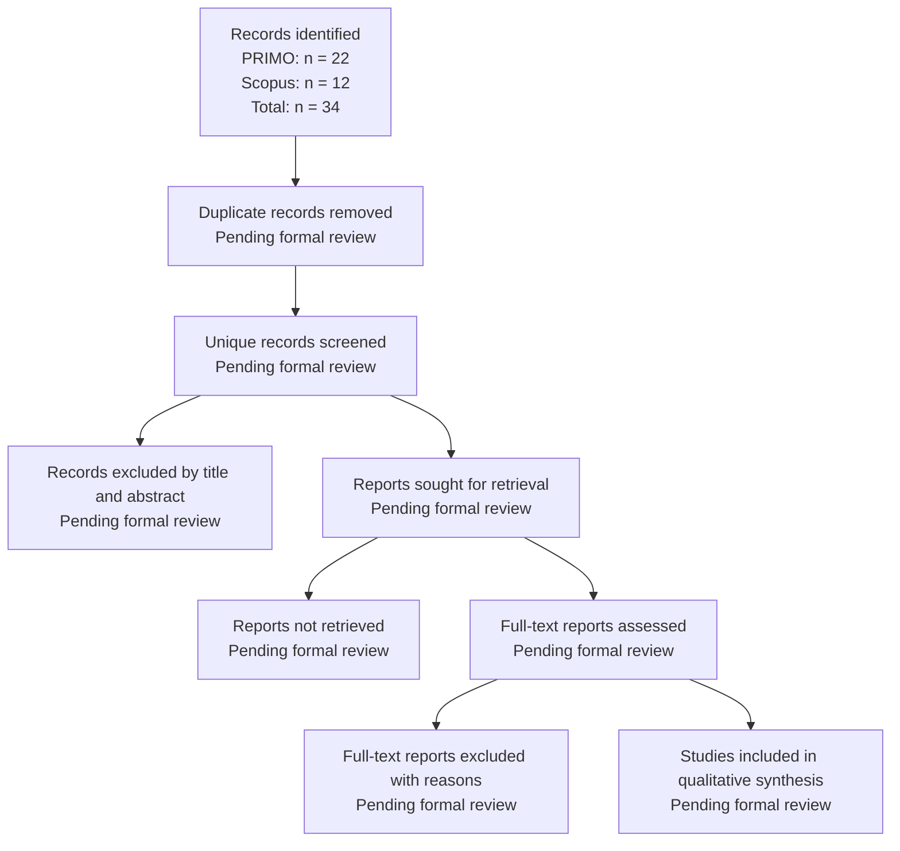

# Systematic Literature Review

**Session 4**

## 1. Overview

This Systematic Literature Review examines research related to banking regulation, regulatory compliance, risk management, Artificial Intelligence, Legal Natural Language Processing, semantic embeddings, and automated document classification.

The review supports the development of a Machine Learning artifact for classifying Peruvian regulatory and institutional PDF documents as:

- **Relevant**.
- **Not relevant**.

The review has two main purposes:

1. To identify methods previously used to analyze and classify legal, banking, regulatory, and compliance-related documents.
2. To determine which methodological and contextual limitations justify the proposed research artifact.

The review follows a PRISMA-inspired selection process covering:

1. Identification of records.
2. Duplicate checking.
3. Title-and-abstract screening.
4. Full-text eligibility assessment.
5. Qualitative synthesis.
6. Identification of literature gaps.

The review is currently considered a focused academic systematic review in progress because the formal screening of all identified records has not yet been completed.

---

# 2. Review Objective

The objective of this review is:

> To identify and analyze previous methods for automatically processing, representing, and classifying legal, banking, regulatory, and compliance-related documents, with particular attention to their applicability to Peruvian regulatory PDF documents.

The review also evaluates whether existing literature addresses:

- Preliminary document-relevance filtering.
- Spanish-language regulatory documents.
- Long-document processing.
- Small specialized datasets.
- Multilingual semantic embeddings.
- Classical Machine Learning classifiers.
- PDF-quality and duplicate controls.

---

# 3. Research Questions Informing the Review

## RQ1: Document-classification methods

> What Machine Learning and Natural Language Processing methods have been used to classify legal, banking, regulatory, or compliance-related documents?

This question examines:

- Traditional Machine Learning.
- Transformer models.
- Legal-domain language models.
- Semantic embeddings.
- Multi-label and binary classification.
- Explainable classification methods.

---

## RQ2: Long-document processing

> How have previous studies processed legal or regulatory documents whose length exceeds the input limits of conventional language models?

This question examines:

- Document segmentation.
- Sliding windows.
- Overlapping chunks.
- Hierarchical architectures.
- Sparse-attention transformers.
- Embedding aggregation.
- Document-level vector construction.

---

## RQ3: Regulatory relevance filtering

> To what extent has previous research addressed preliminary relevance classification before detailed legal or compliance analysis?

This question distinguishes between:

- Initial document filtering.
- Legal-topic classification.
- Obligation extraction.
- Compliance-rule interpretation.
- Regulatory reporting.
- Risk quantification.

---

## RQ4: Language and geographical context

> What evidence exists for Spanish-language, Latin American, or Peruvian legal and regulatory document classification?

This question evaluates:

- Spanish legal-document datasets.
- Multilingual legal benchmarks.
- Latin American applications.
- Peruvian institutional documents.
- Country-specific legal terminology.

---

## RQ5: Small datasets and model complexity

> What methods are suitable for specialized regulatory-document classification when only a relatively small labeled dataset is available?

This question considers:

- Transfer learning.
- Pretrained embeddings.
- Classical Machine Learning.
- Lightweight models.
- Overfitting risks.
- Reproducibility.
- Computational cost.

---

## RQ6: Data-quality controls

> What document and dataset quality controls are reported before legal or regulatory classification models are trained?

This question examines:

- PDF extraction failures.
- Documents without extractable text.
- Duplicate records.
- Label quality.
- Insufficient textual content.
- Train-test leakage.
- Missing or invalid numerical values.

---

# 4. Review Protocol

The literature-review protocol was defined before completing the final synthesis.

It specifies:

- Research questions.
- Databases.
- Search expressions.
- Date restrictions.
- Inclusion criteria.
- Exclusion criteria.
- Screening stages.
- Information to extract.
- Quality-assessment criteria.
- Synthesis strategy.

The protocol was designed to improve transparency and reduce arbitrary study selection.

---

# 5. Information Sources

The principal databases used were:

- **PRIMO**, the institutional academic-discovery service.
- **Scopus**, a multidisciplinary abstract and citation database.

Complementary methodological studies were consulted through:

- ACL Anthology.
- arXiv.
- ScienceDirect.
- Journal and publisher websites.
- Official PRISMA resources.
- DOI and bibliographic metadata services.

The complementary sources were used to verify:

- Publication title.
- Authors.
- Publication year.
- Venue.
- Methodology.
- Dataset.
- Main findings.
- Relationship with the proposed research.

---

# 6. Search Period

The principal database search covered publications between:

```text
1 January 2021 and 31 December 2026
```

Earlier foundational publications were accepted when they were necessary to justify:

- Sentence embeddings.
- Legal-domain language models.
- Long-document processing.
- Hierarchical document classification.
- Systematic-review reporting.

Examples include Sentence-BERT, LEGAL-BERT, Longformer, and early long legal-document classification studies.

---

# 7. Search Strategy

The principal search combined four conceptual blocks:

1. Banking regulation.
2. Compliance risk.
3. Artificial Intelligence.
4. Machine Learning.

The general search expression was:

```text
("banking regulation framework"
AND "compliance risk"
AND "artificial intelligence")
AND "machine learning"
```

The syntax was adapted according to the interface of PRIMO and Scopus.

---

## 7.1 PRIMO Search

### Search fields

| Parameter | Configuration |
|---|---|
| Search scope | Search all |
| First field | Any field |
| First expression | `Banking regulation framework AND Compliance risk AND Artificial Intelligence` |
| Boolean connection | AND |
| Second field | Any field |
| Second expression | `machine learning` |
| Initial material type | All items |
| Initial language filter | No restriction |
| Start date | 1 January 2021 |
| End date | 31 December 2026 |

### PRIMO result

The search produced:

```text
22 records
```

The records addressed areas such as:

- AI-supported banking.
- Automated credit assessment.
- Banking governance.
- Financial-risk management.
- Cybersecurity.
- Data sovereignty.
- Digital transformation.
- Compliance.
- Financial decision-making.

Not every retrieved result was directly related to regulatory-document classification. The records must therefore be evaluated through title-and-abstract screening.

---

## 7.2 Scopus Search

The Scopus search was conducted across:

- Article titles.
- Abstracts.
- Keywords.

The conceptual expression was:

```text
Banking regulation framework
AND risk compliance
AND artificial intelligence
AND machine learning
```

### Applied Scopus filters

| Filter | Configuration |
|---|---|
| Search field | Article title, abstract, and keywords |
| Document type | Article |
| Publication years displayed | 2025–2026 |
| Preprints | Excluded from the 12-document result |
| Results displayed | English-language records |

### Scopus result

The search produced:

```text
12 records
```

The records included topics such as:

- Responsible AI in finance.
- European AI Act compliance.
- Internal auditing of AI risks.
- Personal-data protection.
- Credit-scoring regulation.
- Data sovereignty.
- Islamic-finance regulation.
- Banking performance.
- Digital transformation.
- Financial-risk governance.

---

## 7.3 Consolidated Search Results

| Database | Records identified |
|---|---:|
| PRIMO | 22 |
| Scopus | 12 |
| **Total before duplicate checking** | **34** |

The total of 34 represents the records returned before identifying titles or DOI values that may appear in both databases.

---

# 8. Complementary Search Expressions

Because the principal query focused strongly on banking, additional searches were defined to locate methodological research.

## Search A: Regulatory-document classification

```text
"regulatory document classification"
AND "machine learning"
```

## Search B: Legal-document classification

```text
"legal document classification"
AND
("machine learning" OR "natural language processing")
```

## Search C: Long legal documents

```text
"long legal document classification"
```

## Search D: Semantic embeddings

```text
("sentence embeddings" OR "semantic embeddings")
AND "legal document classification"
```

## Search E: Regulatory compliance

```text
"regulatory compliance"
AND
("natural language processing" OR "machine learning")
```

## Search F: Spanish legal classification

```text
"Spanish legal document classification"
```

## Search G: Latin America and Peru

```text
("Latin American regulation" OR "Peruvian regulation")
AND
("machine learning" OR classification)
```

These searches provide methodological evidence that may not appear in a narrowly focused banking query.

---

# 9. Search Terms and Keywords

## Banking and regulation

- `"banking regulation"`
- `"banking regulation framework"`
- `"financial regulation"`
- `"regulatory framework"`
- `"regulatory monitoring"`
- `"regulatory compliance"`
- `"RegTech"`

## Risk and compliance

- `"compliance risk"`
- `"risk compliance"`
- `"compliance risk management"`
- `"regulatory risk"`
- `"risk management"`

## Artificial Intelligence and Machine Learning

- `"artificial intelligence"`
- `"machine learning"`
- `"natural language processing"`
- `"semantic embeddings"`
- `"sentence embeddings"`
- `"Sentence-BERT"`
- `"transformer models"`

## Legal and regulatory documents

- `"legal document classification"`
- `"regulatory document classification"`
- `"regulatory text classification"`
- `"long legal document"`
- `"legal text classification"`
- `"document relevance"`
- `"legal document review"`

## Language and geographical context

- `"Spanish legal documents"`
- `"Latin American regulation"`
- `"Peruvian regulation"`
- `"documentos regulatorios peruanos"`
- `"clasificación de documentos jurídicos"`
- `"clasificación de documentos regulatorios"`

---

# 10. Inclusion Criteria

A record is eligible when it meets the following criteria:

1. It is a journal article or conference paper.
2. It is related to at least one of the following:
   - Banking regulation.
   - Financial regulation.
   - Compliance.
   - Regulatory risk.
   - Legal documents.
   - Institutional documents.
3. It applies or evaluates:
   - Machine Learning.
   - Natural Language Processing.
   - Semantic embeddings.
   - Transformer models.
   - Information retrieval.
   - Automated document analysis.
4. It contains sufficient methodological information.
5. It is available in English or Spanish.
6. It contributes to at least one project component:
   - PDF classification.
   - Preliminary relevance filtering.
   - Long-document processing.
   - Multilingual representation.
   - Regulatory monitoring.
   - Model evaluation.
7. It was published between 2021 and 2026, except for essential foundational publications.

---

# 11. Exclusion Criteria

A record is excluded when:

1. It has no relationship with regulation, compliance, banking, legal documents, or institutional documents.
2. It contains no Machine Learning, NLP, retrieval, or document-analysis methodology.
3. It focuses exclusively on:
   - Fraud detection.
   - Credit scoring.
   - Customer churn.
   - Stock-market prediction.
   - Financial forecasting.
   - Banking performance.
   
   without analyzing regulatory or legal texts.
4. It only mentions Artificial Intelligence or regulation superficially.
5. It is a duplicate by title or DOI.
6. It is a book, editorial, or incomplete publication without direct methodological relevance.
7. It lacks sufficient abstract or methodological information.
8. It belongs to an unrelated domain.
9. Its full text cannot be obtained and the abstract is insufficient for evaluation.
10. It does not contribute to any of the research questions.

---

# 12. Duplicate Detection

The 22 PRIMO records and 12 Scopus records must be consolidated into a single screening spreadsheet.

Duplicates should be identified using:

1. DOI.
2. Normalized title.
3. Authors and publication year when DOI is unavailable.

The normalized title should:

- Be converted to lowercase.
- Remove punctuation.
- Remove duplicated spaces.
- Ignore minor formatting differences.

Only one copy of each duplicated study should proceed to screening.

---

# 13. Screening Procedure

The review uses the following stages.

## Stage 1: Identification

Records are retrieved from PRIMO and Scopus.

Current total:

```text
34 records before duplicate checking
```

## Stage 2: Duplicate removal

Duplicate records are removed using DOI and title.

## Stage 3: Title-and-abstract screening

Each unique record is evaluated against the inclusion and exclusion criteria.

The decision must be:

- `Include`.
- `Exclude`.
- `Uncertain`.

## Stage 4: Full-text retrieval

The complete publication is sought for records marked `Include` or `Uncertain`.

## Stage 5: Full-text eligibility

The study is evaluated according to:

- Research objective.
- Document type.
- Dataset.
- Method.
- Evaluation.
- Relevance to the artifact.

## Stage 6: Final inclusion

Eligible studies are included in the qualitative synthesis and literature-gap analysis.

---

# 14. Screening Matrix

The following structure should be used to control the review:

| ID | Database | Title | Authors | Year | DOI | Duplicate | Title/abstract decision | Full text | Final decision | Exclusion reason |
|---:|---|---|---|---:|---|---|---|---|---|---|
| 1 | PRIMO |  |  |  |  |  |  |  |  |  |
| 2 | PRIMO |  |  |  |  |  |  |  |  |  |
| 3 | Scopus |  |  |  |  |  |  |  |  |  |

A single explicit exclusion reason should be recorded for every excluded study.

Recommended reasons include:

- Wrong domain.
- No document-analysis method.
- No regulatory or legal context.
- Focused only on structured financial data.
- No Machine Learning or NLP.
- Insufficient methodological information.
- Duplicate record.
- Full text unavailable.

---

# 15. Data Extraction

The following data should be extracted from every included study:

| Field | Description |
|---|---|
| Citation | Authors and publication year |
| Country or context | Jurisdiction or application environment |
| Research objective | Problem addressed |
| Domain | Legal, banking, regulatory, financial, or compliance |
| Document type | Laws, judgments, contracts, PDFs, regulations, clauses |
| Language | Language of the documents |
| Dataset size | Number of records or documents |
| Labels | Binary, multiclass, or multi-label |
| Preprocessing | Cleaning, segmentation, tokenization |
| Text representation | TF-IDF, embeddings, BERT, Sentence-BERT |
| Model | Algorithm or architecture |
| Evaluation metrics | Accuracy, precision, recall, F1, ROC-AUC |
| Main results | Principal findings |
| Limitations | Limitations reported by authors |
| Relevance | Relationship with the proposed project |

---

# 16. Quality Assessment

Each included study should be evaluated using the following questions:

| Quality question | Response |
|---|---|
| Is the research objective clearly stated? | Yes / Partial / No |
| Is the dataset sufficiently described? | Yes / Partial / No |
| Is the preprocessing method explained? | Yes / Partial / No |
| Is the classification method reproducible? | Yes / Partial / No |
| Are evaluation metrics reported? | Yes / Partial / No |
| Are limitations discussed? | Yes / Partial / No |
| Is the study relevant to the review questions? | Yes / Partial / No |

A simple score may be assigned:

```text
Yes = 2 points
Partial = 1 point
No = 0 points
```

With seven questions, the maximum score is:

```text
14 points
```

Suggested interpretation:

| Score | Interpretation |
|---:|---|
| 11–14 | High methodological relevance |
| 7–10 | Moderate methodological relevance |
| 0–6 | Low methodological relevance |

Studies should not be excluded solely because of the score. The score supports the qualitative interpretation.

---

# 17. Synthesis Method

Because the identified studies use different:

- Research objectives.
- Datasets.
- Labels.
- Languages.
- Models.
- Evaluation measures.

A statistical meta-analysis is not appropriate.

The review therefore uses a **qualitative narrative synthesis**.

The studies are grouped according to:

1. Legal and regulatory document classification.
2. Long-document processing.
3. Semantic and multilingual representations.
4. Banking AI and regulatory compliance.
5. Risk, governance, and data protection.
6. Preliminary relevance filtering.
7. Data-quality and reproducibility practices.

---

# 18. Current Results

## 18.1 Number of Studies Found

| Review stage | Current number |
|---|---:|
| Records identified in PRIMO | 22 |
| Records identified in Scopus | 12 |
| Total records before duplicate checking | 34 |
| Duplicates removed | Pending formal review |
| Unique records screened | Pending formal review |
| Records excluded by title and abstract | Pending formal review |
| Full texts retrieved | Pending formal review |
| Full texts assessed | Pending formal review |
| Final included studies | Pending formal review |

The only final verified value at this stage is:

```text
Initial database records: 34
```

The final included-study count will be completed after reviewing the screening matrix.

---

## 18.2 PRISMA Flow Diagram



The pending values must be replaced only after the corresponding decisions are recorded in the screening matrix.

---

# 19. Preliminary Themes Identified

## Theme 1: Artificial Intelligence in banking and finance

Several identified records examine:

- AI adoption in banking.
- Generative AI.
- Financial decision-making.
- Banking automation.
- Digital financial products.
- Banking performance.

These studies demonstrate the importance of Artificial Intelligence in the financial sector but do not necessarily classify regulatory documents.

---

## Theme 2: Regulatory compliance and AI governance

The identified records include studies concerning:

- European AI Act compliance.
- Responsible AI.
- Ethical AI.
- Internal auditing.
- Regulatory reporting.
- Financial-sector oversight.

These studies provide regulatory context but often focus on governance obligations rather than preliminary document relevance.

---

## Theme 3: Risk management and financial stability

Several studies address:

- Credit risk.
- Regulatory risk.
- Financial stability.
- Cybersecurity.
- Risk governance.
- AI-assisted auditing.

These studies support the importance of regulatory-risk monitoring but frequently use financial or transactional data instead of regulatory PDF text.

---

## Theme 4: Data protection and data sovereignty

Some studies examine:

- Personal-data protection.
- Data privacy.
- Data sovereignty.
- Banking disclosure.
- Digital financial-system security.

These topics justify the inclusion of data protection in the relevant-document category.

---

## Theme 5: Long legal-document processing

Methodological studies identify document length as a major challenge.

Common solutions include:

- Segmentation.
- Hierarchical models.
- Sparse attention.
- Sliding windows.
- Chunk selection.
- Aggregation of chunk embeddings.

This theme directly supports the fragmentation strategy used in the proposed artifact.

---

## Theme 6: Multilingual and Spanish legal-text classification

Existing studies show that legal-document classification can be performed across multiple languages and with Spanish legal texts.

However, the most established datasets focus on:

- European legislation.
- Court judgments.
- Large multilingual corpora.

They do not directly represent Peruvian institutional regulations.

---

## Theme 7: Model complexity and efficient baselines

The literature compares:

- Large pretrained transformers.
- Domain-specific transformers.
- Hierarchical architectures.
- Linear baselines.
- Classical Machine Learning.

This theme supports comparing simpler models when the dataset is small and computational resources are limited.

---

# 20. Preliminary Answers to the Research Questions

## Answer to RQ1

Previous studies use:

- Logistic Regression.
- Support Vector Machines.
- Tree-based models.
- Neural networks.
- BERT.
- LEGAL-BERT.
- Longformer.
- Hierarchical transformers.
- Sentence embeddings.
- Multilingual transformer models.

The proposed project contributes by combining multilingual embeddings with classical classifiers for binary regulatory-document relevance.

---

## Answer to RQ2

Long legal documents are commonly processed using:

- Segmentation.
- Sliding windows.
- Hierarchical encoding.
- Sparse attention.
- Chunk aggregation.

The proposed project applies overlapping chunks and averages their semantic embeddings to create one vector per PDF.

---

## Answer to RQ3

Preliminary document filtering is less represented than advanced activities such as:

- Obligation extraction.
- Legal prediction.
- Compliance reporting.
- Risk analysis.
- Governance assessment.

The proposed artifact focuses specifically on deciding whether a document should receive detailed review.

---

## Answer to RQ4

Multilingual and Spanish legal classification exists, but the reviewed literature provides limited evidence for:

- Peruvian regulatory documents.
- Documents from BCRP, SBS, or PCM.
- Binary relevance filtering.
- Small local datasets.

---

## Answer to RQ5

For small datasets, promising approaches include:

- Pretrained representations.
- Transfer learning.
- Semantic embeddings.
- Strong classical baselines.
- Limited model complexity.
- Careful validation.

This supports the use of Logistic Regression, linear SVM, and Random Forest over pretrained multilingual embeddings.

---

## Answer to RQ6

Data-quality practices are not always described in sufficient detail.

The proposed artifact explicitly includes:

- Two PDF-extraction methods.
- Exclusion of documents without usable text.
- Duplicate detection.
- Train-test separation before embedding-based evaluation.
- Verification of shared documents.
- Numerical validation of embeddings.

---

# 21. Preliminary Gaps in the Literature

The systematic review supports the following preliminary gaps:

1. Limited evidence involving Peruvian regulatory PDFs.
2. Limited research on preliminary binary relevance filtering.
3. Limited lightweight methods for small Spanish-language datasets.
4. Limited reporting of PDF-extraction and duplicate controls.
5. Limited comparison of classical classifiers using multilingual embeddings.
6. Limited integration between regulatory monitoring and Design Science.
7. Limited external validation using unseen Peruvian institutional documents.

A detailed explanation of these gaps is presented in:

```text
04_literature/gap_analysis.md
```

---

# 22. Review Limitations

The review has the following limitations:

- Only PRIMO and Scopus were used as principal discovery databases.
- The screening of the 34 records is not yet complete.
- The review is being conducted by one research team.
- Independent screening by a second reviewer has not yet been performed.
- Some relevant studies may exist in local repositories.
- Proprietary RegTech systems may not be publicly documented.
- Search results may change as databases are updated.
- The focused banking query may exclude studies using different terminology.
- Several foundational methodological studies were published before the selected date range.
- Search-result relevance cannot be determined solely from titles.

---

# 23. Conclusion

The current literature indicates that Artificial Intelligence and Machine Learning are widely applied in banking, risk management, financial governance, legal-document analysis, and regulatory compliance.

Existing research also provides well-established methods for:

- Semantic embeddings.
- Legal-domain language models.
- Long-document segmentation.
- Multilingual classification.
- Classical and transformer-based classifiers.

Nevertheless, limited evidence was identified for a solution combining:

- Peruvian regulatory PDFs.
- Binary relevance classification.
- Spanish-language institutional documents.
- Small labeled datasets.
- Overlapping text fragments.
- Multilingual embeddings.
- Classical Machine Learning comparison.
- Explicit PDF and duplicate controls.

The proposed artifact is designed to address this combination of needs.

---

# 24. References

Beltagy, I., Peters, M. E., and Cohan, A. (2020). Longformer: The Long-Document Transformer. *arXiv preprint arXiv:2004.05150*.

Chalkidis, I., Fergadiotis, M., Malakasiotis, P., Aletras, N., and Androutsopoulos, I. (2020). LEGAL-BERT: The Muppets straight out of Law School. *Findings of the Association for Computational Linguistics: EMNLP 2020*, 2898–2904.

Chalkidis, I., Fergadiotis, M., and Androutsopoulos, I. (2021). MultiEURLEX: A Multi-lingual and Multi-label Legal Document Classification Dataset for Zero-shot Cross-lingual Transfer. *Proceedings of EMNLP 2021*, 6974–6996.

de Arriba-Pérez, F., García-Méndez, S., González-Castaño, F. J., and González-González, J. (2022). Explainable Machine Learning Multi-label Classification of Spanish Legal Judgements. *Journal of King Saud University – Computer and Information Sciences, 34*(10), 10180–10192.

Limsopatham, N. (2021). Effectively Leveraging BERT for Legal Document Classification. *Proceedings of the Natural Legal Language Processing Workshop 2021*.

Mamakas, D., Tsotsi, P., Androutsopoulos, I., and Chalkidis, I. (2022). Processing Long Legal Documents with Pre-trained Transformers: Modding LegalBERT and Longformer. *Proceedings of the Natural Legal Language Processing Workshop 2022*, 130–142.

Page, M. J., McKenzie, J. E., Bossuyt, P. M., Boutron, I., Hoffmann, T. C., Mulrow, C. D., et al. (2021). The PRISMA 2020 Statement: An Updated Guideline for Reporting Systematic Reviews. *BMJ, 372*, n71.

Park, H. H., Vyas, Y., and Shah, K. (2022). Efficient Classification of Long Documents Using Transformers. *arXiv preprint arXiv:2203.11258*.

Pappagari, R., Zelasko, P., Villalba, J., Carmiel, Y., and Dehak, N. (2019). Hierarchical Transformers for Long Document Classification. *2019 IEEE Automatic Speech Recognition and Understanding Workshop*, 838–844.

Reimers, N., and Gurevych, I. (2019). Sentence-BERT: Sentence Embeddings Using Siamese BERT-Networks. *Proceedings of EMNLP-IJCNLP 2019*, 3982–3992.

Wan, L., Papageorgiou, G., Seddon, M., and Bernardoni, M. (2019). Long-length Legal Document Classification. *arXiv preprint arXiv:1912.06905*.
